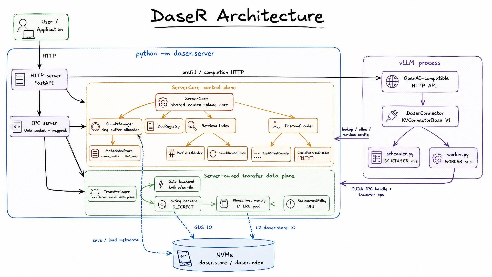

# DaseR

<p align="center">
  
</p>

RAG-native KV cache service for LLM inference. Integrates with vLLM via `KVConnectorBase_V1`; the current storage path uses server-managed io_uring with pinned-memory L1 and NVMe L2, while GDS/cuFile remains an optional compatibility backend.

## Architecture



## Install

```bash
source <venv>/bin/activate
pip install -e .
```

## Docs

- [System design](docs/design/) — architecture, components, data flows
- [Development guide](docs/development.md) — server setup, tests, lint, benchmarks, vLLM integration
- [Insights](docs/insights/) — research motivation, related work, roadmap
- [Optimizations](docs/optimizations/) — performance records and benchmarks
- [Contributing](CONTRIBUTING.md) — branch conventions, commit format, PR process

## License

DaseR is licensed under the [Apache License 2.0](LICENSE).
