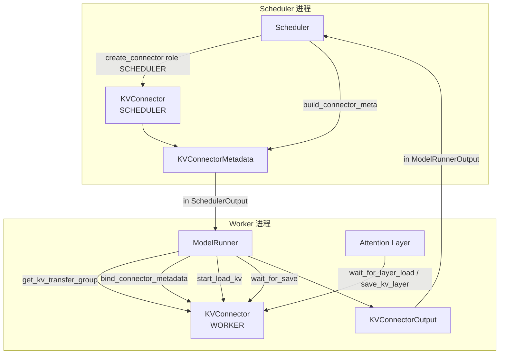
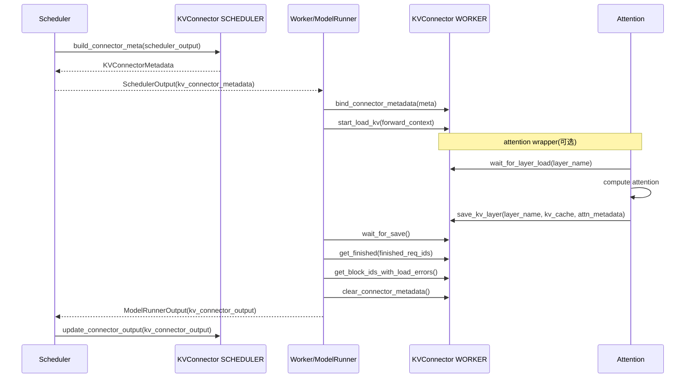
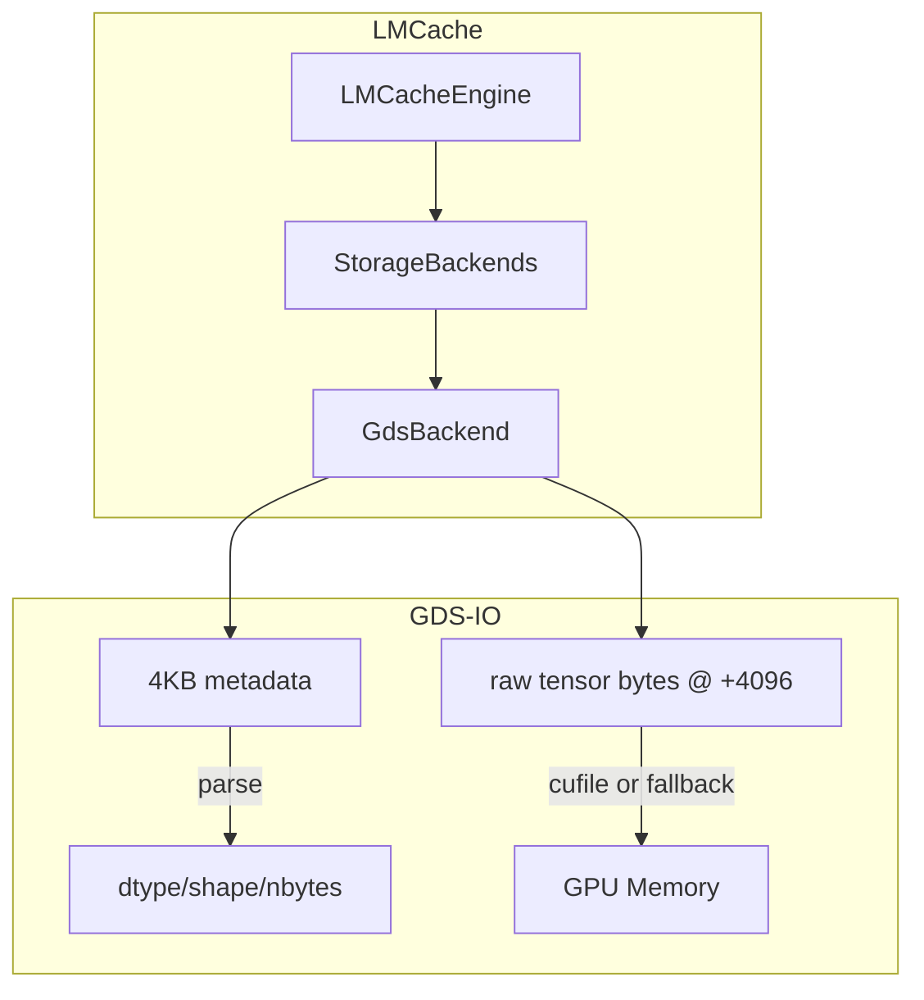
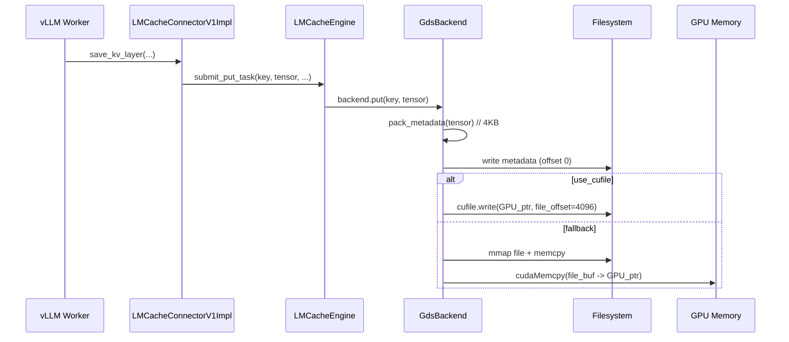

# vLLM v1 KV Connector 模块梳理（含 Offloading / LMCache(GDS)）

> 目标：把 vLLM v1 的 **KV Connector** 这一整套模块按“抽象 → 动态加载 → vLLM 初始化/调用上下文 → 具体实现（Offloading / LMCache+GDS）”的顺序，做一份可读、可落地的说明文档，并配必要的模块图/时序图。
>
> 代码基于当前仓库目录（2026-01-29）：
> - `vllm/vllm/distributed/kv_transfer/kv_connector/`（connector 总入口）
> - `vllm/vllm/v1/core/sched/scheduler.py`（Scheduler 侧创建/驱动 connector）
> - `vllm/vllm/v1/worker/kv_connector_model_runner_mixin.py`（Worker 侧绑定 metadata、触发 load/save 生命周期）
> - `vllm/vllm/attention/utils/kv_transfer_utils.py`（Attention 层对 wait/load/save 的钩子）
> - `LMCache/lmcache/v1/storage_backend/gds_backend.py`（LMCache 的 GDS 存储后端实现）

---

## 1. KV Connector 是什么：它解决的问题与边界

在 vLLM v1 里，“KV Connector”是一个 **跨进程/跨节点 KV Cache 传输与持久化的扩展点**。

它的定位是：

- **Scheduler 侧（控制面）**：
  - 判断“外部缓存里是否有可复用的 prompt 前缀 KV”。
  - 决定本 step 需要对哪些 request 做 **load（外部→GPU KV cache）** 或 **store（GPU→外部）**。
  - 把“本 step 的传输计划（metadata）”塞进 `SchedulerOutput`，发给 worker。

- **Worker 侧（数据面）**：
  - 收到 scheduler 给的 metadata 后，真正把 KV 做 load/store。
  - 支持异步 load/store（尽可能与 forward / sampling 重叠）。
  - 把“哪些 request 的异步任务完成了”“有哪些 load 失败的 blocks”等结果打包回 scheduler。

你可以把它理解为：vLLM 在 **“prefix cache（外部）”** 这条链路上留的一个稳定插槽。

---

## 2. 核心抽象：`KVConnectorBase_V1`

核心抽象在：

- `vllm/vllm/distributed/kv_transfer/kv_connector/v1/base.py`

这个文件开头 docstring 已经非常关键：它明确把接口分为 **Scheduler-side** 和 **Worker-side** 两套原语，并且强调某些方法“可多次调用、必须无副作用”。

### 2.1 角色分离：`KVConnectorRole`

`KVConnectorBase_V1` 的构造函数带 `role: KVConnectorRole`：

- `KVConnectorRole.SCHEDULER`：运行在 scheduler 进程。
- `KVConnectorRole.WORKER`：运行在每个 worker 进程。

这一点非常重要：同一个 connector “类”，会在两个进程里各自实例化一份，但职责完全不同。

### 2.2 Scheduler ↔ Worker 的桥：`KVConnectorMetadata`

- `KVConnectorMetadata`：抽象的 metadata（需要可序列化），用于 scheduler 把“本 step 要做的 load/store 计划”告诉 worker。
- Worker 侧通过：
  - `bind_connector_metadata(...)`：在一个 forward 前设置 metadata。
  - `clear_connector_metadata()`：forward 结束后清理。

connector 内部通过 `_get_connector_metadata()` 读取绑定的 metadata（断言不为 None）。

> 这就是为什么 vLLM 把 bind/clear 放在模型执行的生命周期里：metadata 的语义是“**当前 step** 的传输计划”。

### 2.3 Worker-side 方法：load/save 生命周期

`KVConnectorBase_V1` 的 worker 侧方法可以按时间线理解：

1) **forward 之前**：
- `start_load_kv(forward_context, ...)`
  - 启动“外部 KV → GPU paged KV buffer”的加载。
  - 设计目标是：尽可能异步、尽可能与 forward 重叠。

2) **attention 层进入时（可选）**：
- `wait_for_layer_load(layer_name)`
  - 某些 connector 支持 layer-by-layer pipeline：attention 真的要用到该层 KV 前，确保该层 KV 已经加载好。

3) **attention 层退出时（可选）**：
- `save_kv_layer(layer_name, kv_layer, attn_metadata, ...)`
  - 在 attention 执行完后触发对该 layer KV 的保存（可以异步）。

4) **forward 结束**：
- `wait_for_save()`
  - 确保保存完成，避免 paged KV buffer 在下一步被覆盖导致数据错误。

此外还有：

- `handle_preemptions(preempted_req_ids)`：
  - 处理“请求被抢占、blocks 将要被覆盖”的情况，适合异步 store 的实现（例如 OffloadingConnector）。

- `get_finished(finished_req_ids)`：
  - 给 worker 一个机会返回“哪些 req 的异步 store/load 已经完成”。

- `get_block_ids_with_load_errors()`：
  - 把 load 失败的 blocks 上报给 scheduler，让 scheduler 决定是否走“recompute”策略。

### 2.4 Scheduler-side 方法：决定“可复用多少 tokens”与“本步做哪些传输”

Scheduler 侧最关键的 3 个方法：

1) `get_num_new_matched_tokens(request, num_computed_tokens) -> (n | None, async)`

- 语义：在本 request 上，外部缓存能提供多少 **超过本地已计算 tokens** 的 KV。
- 返回 `None` 表示“connector 还没准备好，需要以后再问”。
- 返回的 `async` 表示是否异步加载（发生在 scheduler steps 之间）。

2) `update_state_after_alloc(request, blocks, num_external_tokens)`

- scheduler 会给 request 分配 GPU blocks。
- 如果决定从外部加载 `num_external_tokens`，那么 connector 可以在这里：
  - 记录 request/block_ids
  - 准备 load 的传输 spec（比如 src/dst block 映射）

3) `build_connector_meta(scheduler_output) -> KVConnectorMetadata`

- 在每个 scheduling step 结束时调用。
- 必须：
  - 把本 step 的 load/store 计划封装成 metadata
  - **清理 connector 的 step 内状态**（注释里明确说“calling this resets state”）

### 2.5 HMA（Hybrid Memory Allocator）支持与约束

`v1/base.py` 里有 `SupportsHMA`：

- 某些 connector 若要与 HMA 一起工作，需要实现 `request_finished_all_groups(...)`。
- factory 会检查：如果启用了 HMA 但 connector 不支持，则直接报错。

对应 factory 逻辑：

- `vllm/vllm/distributed/kv_transfer/kv_connector/factory.py` 中：
  - `hma_enabled = not config.scheduler_config.disable_hybrid_kv_cache_manager`
  - `if hma_enabled and not supports_hma(connector_cls): raise ValueError(...)`

---

## 3. 动态加载：`KVConnectorFactory` 如何选择并创建不同 connector

入口在：

- `vllm/vllm/distributed/kv_transfer/kv_connector/factory.py`

### 3.1 两种“按名字找类”的方式

`_get_connector_class_with_compat(kv_transfer_config)` 大致流程是：

1) 读配置：
- `connector_name = kv_transfer_config.kv_connector`

2) 如果名字在 registry（`_registry`）里：
- 通过 lazy loader import 对应模块，返回 class。

3) 如果不在 registry：
- 走 `kv_transfer_config.kv_connector_module_path`
- 动态 import module，然后用 `getattr(connector_module, connector_name)` 找到类。

这意味着你可以：

- 用内置 connector：配置 `kv_connector="OffloadingConnector"` / `"LMCacheConnectorV1"` 等。
- 或者把自己的 connector 放到任意 module，通过 `kv_connector_module_path` 动态注入（无需改 vLLM 源码）。

### 3.2 为什么 factory 要做“兼容旧签名”的判断

`create_connector(...)` 会区分两种构造签名：

- 新签名：`__init__(self, vllm_config, role, kv_cache_config)`
- 旧签名：`__init__(self, vllm_config, role)`

factory 用 `supports_kw(connector_cls, "kv_cache_config")` 判断，若不支持则打 warning 并走旧签名。

> 这点对自定义 connector 很重要：建议直接实现新签名，否则未来可能被移除。

### 3.3 内置 connector 的注册点

在 `factory.py` 底部集中注册（强调“不要在各自文件注册，避免无用 import”）：

- `OffloadingConnector`
- `LMCacheConnectorV1`
- `NixlConnector` / `P2pNcclConnector` / `MultiConnector` 等

这就是动态加载的关键：**只有被选中的 connector 才会 import 对应模块**。

---

## 4. vLLM 中 connector 的初始化与调用：上下文全流程

这一节把“谁在什么时候调用哪些函数”串起来。

### 4.1 Scheduler 进程：创建 + 每步产出 metadata

在 `vllm/vllm/v1/core/sched/scheduler.py`：

- Scheduler 初始化时，如果 `vllm_config.kv_transfer_config is not None`：
  - `self.connector = KVConnectorFactory.create_connector(... role=SCHEDULER ...)`

- 每个 schedule step 结束时：
  - `meta = self.connector.build_connector_meta(scheduler_output)`
  - `scheduler_output.kv_connector_metadata = meta`

也就是说：**connector 的 metadata 被当作 `SchedulerOutput` 的一部分，从 scheduler 发给 worker**。

### 4.2 Worker 进程：初始化 connector agent（全局 transfer group）

在 `vllm/vllm/distributed/kv_transfer/kv_transfer_state.py`：

- `ensure_kv_transfer_initialized(vllm_config, kv_cache_config)`
  - 若 `kv_transfer_config.is_kv_transfer_instance` 且未初始化：
  - `_KV_CONNECTOR_AGENT = KVConnectorFactory.create_connector(... role=WORKER ...)`

worker 侧后续通过：

- `get_kv_transfer_group()` 获取这个全局 connector。

### 4.3 Worker 执行一次模型：bind → start_load → (layer wait/save) → wait_for_save → output

关键逻辑在 `vllm/vllm/v1/worker/kv_connector_model_runner_mixin.py`。

核心生命周期（简化版）：

1) `bind_connector_metadata(scheduler_output.kv_connector_metadata)`
2) `start_load_kv(get_forward_context())`
3) forward 过程中：
   - attention 装饰器在进入/退出 attention 时调用：
     - `wait_for_layer_load(layer_name)`
     - `save_kv_layer(layer_name, kv_cache, attn_metadata)`
4) forward 结束：
   - `wait_for_save()`
5) 收尾：
   - `finished_sending, finished_recving = get_finished(scheduler_output.finished_req_ids)`
   - `invalid_block_ids = get_block_ids_with_load_errors()`
   - `kv_cache_events = get_kv_connector_kv_cache_events()`
   - `clear_connector_metadata()`

其中 attention 装饰器在：

- `vllm/vllm/attention/utils/kv_transfer_utils.py`

它在 `has_kv_transfer_group()` 且 `is_v1_kv_transfer_group()` 时才生效。

### 4.4 Scheduler 收到 worker 输出：完成 load/store 的“记账”

worker 的 `KVConnectorOutput` 会被封装在 `ModelRunnerOutput.kv_connector_output` 里（见 `vllm/vllm/v1/outputs.py`）。

Scheduler 侧随后会调用 connector 的：

- `update_connector_output(connector_output)`

以通知 connector：

- 哪些 req 的异步 store 已完成（`finished_sending`）
- 哪些 req 的异步 load 已完成（`finished_recving`）

> OffloadingConnector 正是靠这一步去 `complete_store/complete_load`，让 manager 更新状态。

---

## 5. 图：模块图与时序图（建议用 Mermaid 渲染）

### 5.1 模块图：vLLM v1 KV Connector 总体



### 5.2 时序图：一次 step 的 metadata 下发与 load/save



---

## 6. OffloadingConnector：通过 vLLM `kv_offload` 子系统把 KV 落到“外部介质”

实现文件：

- `vllm/vllm/distributed/kv_transfer/kv_connector/v1/offloading_connector.py`

### 6.1 它的结构：Connector 只是“壳”，核心在 Scheduler/Worker 两个内部类

`OffloadingConnector(KVConnectorBase_V1)` 内部维护：

- `OffloadingConnectorScheduler`（scheduler 侧）
- `OffloadingConnectorWorker`（worker 侧）

它们共同依赖一个 `OffloadingSpec`：

- spec 由 `OffloadingSpecFactory.create_spec(vllm_config, kv_cache_config)` 构造
- spec 提供：
  - block 大小：`gpu_block_size` / `offloaded_block_size`
  - manager：`spec.get_manager()`（管理索引、LRU、可用空间、事件等）
  - handlers：`spec.get_handlers(...)`（负责 GPU ↔ 外部介质 的实际 copy）

### 6.2 OffloadingConnectorMetadata：每步只携带“load/store 计划”

```python
@dataclass
class OffloadingConnectorMetadata(KVConnectorMetadata):
    reqs_to_load: dict[ReqId, TransferSpec]
    reqs_to_store: dict[ReqId, TransferSpec]
```

`TransferSpec` 本质是 `(src_spec, dst_spec)`，其中 `src_spec/dst_spec` 通常是 `GPULoadStoreSpec([...block_ids...])` 或者外部介质的 spec。

### 6.3 “什么时候加载（load）”：命中检测发生在 scheduler

关键在 `OffloadingConnectorScheduler.get_num_new_matched_tokens(...)`：

- 它把 request 的 `block_hashes` 按 `offloaded_block_size` 粒度切块。
- `self.manager.lookup(...)` 返回“连续命中多少块”。
- 如果命中不足一个 offloaded block，就返回 0。
- 如果命中足够：返回 `num_hit_tokens` 并且 `async=True`。

这告诉 vLLM：

- 这部分 tokens 不需要计算，可以走外部 KV load。

### 6.4 “怎么生成 load 计划”：在 `update_state_after_alloc`

当 scheduler 决定要加载 `num_external_tokens` 后，会先给 request 分配 GPU blocks。

`update_state_after_alloc` 做两件事：

1) 把外部要加载的 block_hashes 交给 manager：
- `src_spec = self.manager.prepare_load(block_hashes)`

2) 把 GPU 上“待填充的 block_ids”封成 dst_spec：
- `dst_spec = GPULoadStoreSpec(block_ids[num_computed_gpu_blocks:])`

最后写入：

- `self._reqs_to_load[req_id] = (src_spec, dst_spec)`

### 6.5 “什么时候存储（store/offload）”：按 offloaded_block_size 的整块推进

关键在 `_get_reqs_to_store(scheduler_output)`：

- 它遍历“新请求 + cached 请求”（`yield_req_data`）。
- 通过 `scheduler_output.num_scheduled_tokens[req_id]` 知道本 step 新算了多少 tokens。
- 将总 tokens 对齐到 `offloaded_block_size` 粒度，计算这一步新产生了多少 **完整 offloaded blocks**。
- 调 `store_output = manager.prepare_store(new_block_hashes)` 获取：
  - `store_spec`
  - `block_hashes_to_store`（有些块可能已存在或不需要再写）

然后把 GPU block_ids 映射到需要 store 的那些 offloaded blocks，并写入 `reqs_to_store`。

### 6.6 “为什么 store 会被刻意延后到下一步再提交”

在 worker 侧 `OffloadingConnectorWorker.prepare_store_kv(...)` 里有一段非常关键的注释：

> defer the store to the beginning of the next engine step,
> so that offloading starts AFTER transfers related to token sampling,
> thereby avoiding delays to token generation due to offloading.

也就是：

- 本 step 先把“要 store 的工作”放到 `_unsubmitted_store_jobs`。
- 下一 step 开始时（`start_kv_transfers` / `handle_preemptions`）才真正 `transfer_async(...)`。

这是一种典型的“把重 I/O 放到下一步、尽量不阻塞 token 生成”的工程取舍。

### 6.7 store/load 的完成回传：Scheduler `update_connector_output`

worker `get_finished()` 返回两类集合：

- `finished_sending`：store 完成（但还要考虑 request 是否已 finished）
- `finished_recving`：load 完成

Scheduler 收到后：

- 对 store：`manager.complete_store(block_hashes)`
- 对 load：`manager.complete_load(block_hashes)`

对应实现见 `OffloadingConnectorScheduler.update_connector_output(...)`。

---

## 7. LMCacheConnectorV1：把 KV 交给 LMCache 引擎（并可落到 GDS）

入口文件：

- `vllm/vllm/distributed/kv_transfer/kv_connector/v1/lmcache_connector.py`

### 7.1 结构：vLLM 侧只是“薄封装”，核心逻辑在 LMCacheConnectorV1Impl

`LMCacheConnectorV1` 构造时会根据配置选择 adapter：

- `use_native=True`：用 vLLM repo 内置的 adapter（更容易与已安装的 LMCache 版本 API 不匹配）：
  - `vllm/vllm/distributed/kv_transfer/kv_connector/v1/lmcache_integration/vllm_v1_adapter.py`
- 否则：用外部 `lmcache.integration.vllm.vllm_v1_adapter`（更新更快的实现；推荐默认）。

然后：

- `self._lmcache_engine = LMCacheConnectorV1Impl(vllm_config, role, self)`

后续所有接口（`start_load_kv`/`save_kv_layer`/`build_connector_meta`/`request_finished` 等）基本都是转发给 `_lmcache_engine`。

### 7.2 Scheduler/Worker 视角：它同样遵循 KVConnectorBase_V1 的生命周期

- Worker 侧：
  - `start_load_kv` / `wait_for_layer_load` / `save_kv_layer` / `wait_for_save`

- Scheduler 侧：
  - `get_num_new_matched_tokens` / `update_state_after_alloc` / `build_connector_meta`

区别在于：

- OffloadingConnector 的“外部介质管理”由 vLLM `kv_offload` 负责。
- LMCacheConnector 的“外部介质管理”由 LMCache Engine 负责（它自己有 storage backend 链、元数据、热缓存、审计等）。

### 7.3 GDS Backend 在 LMCache 中的位置：是 storage backend 链的一环

GDS backend 的创建入口在：

- `LMCache/lmcache/v1/storage_backend/__init__.py` 的 `CreateStorageBackends(...)`

只要 `LMCacheEngineConfig.gds_path is not None`：

- 就会 `gds_backend = GdsBackend(config, metadata, loop, dst_device)`
- 并加入 `storage_backends`。

这意味着：

- vLLM 选择 `LMCacheConnectorV1`
- LMCache engine 在构建 storage backends 时发现配置了 `gds_path`
- 于是 load/store 最终可能落到 GDS backend。

### 7.4 GdsBackend 的实现逻辑（重点）

实现文件：

- `LMCache/lmcache/v1/storage_backend/gds_backend.py`

#### 7.4.1 核心目标

- 尽量通过 NVIDIA cuFile 发起“GPU Direct Storage”读写：
  - 直接从文件系统把数据写入/读出 GPU 内存（理想路径）。
- 如果文件系统/环境不支持，cuFile 会 fallback 到 POSIX I/O；或者代码中走另一条 fallback 路径（mmap + cudaMemcpy）。

#### 7.4.2 文件格式：4KB metadata + raw tensor bytes

文件级关键常量：

- `_METADATA_MAX_SIZE = 4096`

`pack_metadata(...)` 会把 tensor 的 dtype/shape/offsets 等信息 JSON 序列化，填充到 4KB 内。

数据区布局：

- [0, 4096) ：metadata
- [4096, ...)：tensor bytes

（文档化意义：你可以用 metadata 快速判断 dtype/shape/nbytes，再决定如何分配 GPU buffer，再读 data 区。）

#### 7.4.3 选择 cuFile 还是 fallback：基于 fstype 与配置

`GdsBackend.__init__` 做了：

- 读取 `/proc/mounts`，通过 `get_fstype(path)` 找到 `gds_path` 对应文件系统类型。
- 默认 `self.use_cufile=True`，但对 `tmpfs/overlayfs` 会自动禁用（除非用户在 extra_config 强制）。
- 对 `wekafs` 会强制启用，并开启 thread pool。

#### 7.4.4 读写路径概览（概念级）



#### 7.4.5 时序图：LMCache(GDS) 存储一次 KV（抽象）

> 注意：LMCache engine 的上层调用细节非常多（异步、batch、key 管理等），这里用“backend 视角”抓住关键动作。



---

## 8. OffloadingConnector vs LMCacheConnector：关键差异对比

| 维度 | OffloadingConnector | LMCacheConnectorV1 |
|---|---|---|
| vLLM 侧实现形态 | `kv_connector` + vLLM 内置 `kv_offload` | `kv_connector` + 委托 LMCache Engine |
| 外部介质抽象 | `OffloadingSpec/Manager/Worker/Handler`（vLLM 统一抽象） | LMCache 自己的 StorageBackend 链（LocalCPU/LocalDisk/Remote/GDS/插件等） |
| “何时 store”策略 | 明确延后到下一 step 提交（避免阻塞 sampling） | 由 LMCache 引擎自行决定（可异步/批量/多 backend） |
| 元数据/索引 | 由 vLLM kv_offload manager 管理 | LMCache 自己管理 key→路径/metadata/缓存 |
| GDS 路径 | 不内置（除非你在 vLLM kv_offload 的 spec/handler 自己实现） | 内置 `GdsBackend`，由配置 `gds_path` 启用 |

一句话总结：

- **OffloadingConnector**：把 KV 持久化/卸载能力“收敛进 vLLM 自己的 kv_offload 体系”。
- **LMCacheConnector**：把这件事“外包给 LMCache”，vLLM 只负责把 KV 的生命周期钩子交出去。

---

## 9. 你可以从哪里继续深入（建议阅读路径）

如果你要继续做二次开发/验证行为，推荐按这个路径读代码：

1) 接口与生命周期：
- `vllm/vllm/distributed/kv_transfer/kv_connector/v1/base.py`

2) 动态加载与配置入口：
- `vllm/vllm/distributed/kv_transfer/kv_connector/factory.py`

3) vLLM 调用现场：
- `vllm/vllm/v1/core/sched/scheduler.py`（构造 connector、每步 build meta）
- `vllm/vllm/v1/worker/kv_connector_model_runner_mixin.py`（bind/load/save/wait/output）
- `vllm/vllm/attention/utils/kv_transfer_utils.py`（layer 级 wait/save 钩子）

4) 两个重点实现：
- Offloading：`vllm/vllm/distributed/kv_transfer/kv_connector/v1/offloading_connector.py`
- LMCache：`vllm/vllm/distributed/kv_transfer/kv_connector/v1/lmcache_connector.py`

5) LMCache 的 GDS：
- 创建点：`LMCache/lmcache/v1/storage_backend/__init__.py`
- 实现：`LMCache/lmcache/v1/storage_backend/gds_backend.py`

---

## 10. 常见问题（FAQ）

### Q1：为什么 `wait_for_layer_load/save_kv_layer` 是在 attention 层触发的？

因为 KV 的最小语义单位往往是“某一层的 KV”。

- `start_load_kv` 适合做“尽早开始的批量异步 load”。
- 但真正要用该层 KV 之前，仍需要一个“精确的同步点”，这就是 `wait_for_layer_load(layer_name)`。

### Q2：为什么 worker 侧在 forward 结束时一定要 `wait_for_save()`？

因为 vLLM 的 paged KV buffer 会在后续 step 被复用/覆盖。

如果 store 还没写完就覆盖，会导致写出数据错误，甚至造成外部缓存污染。

### Q3：OffloadingConnector 为什么把 store 延后到下一 step？

这是一个吞吐/延迟权衡：

- token sampling 和输出对“尾延迟”非常敏感。
- offload/store 常常是重 I/O；如果与 sampling 并发可能争用资源。
- 所以它选择：本 step 只“计划 store”，下一步开始再提交。

---

> 如果你希望我把这份文档继续扩展到“如何在 `VllmConfig` / CLI 中配置 kv_transfer_config（含 LMCache 的 gds_path 示例）”并补一段可运行的最小配置样例，我也可以继续补充。
