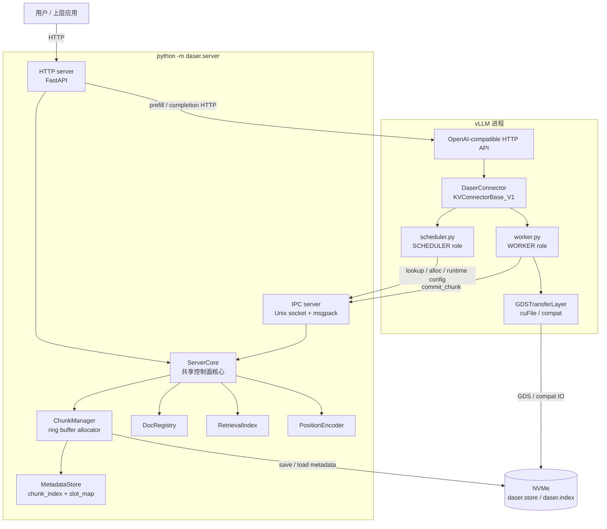
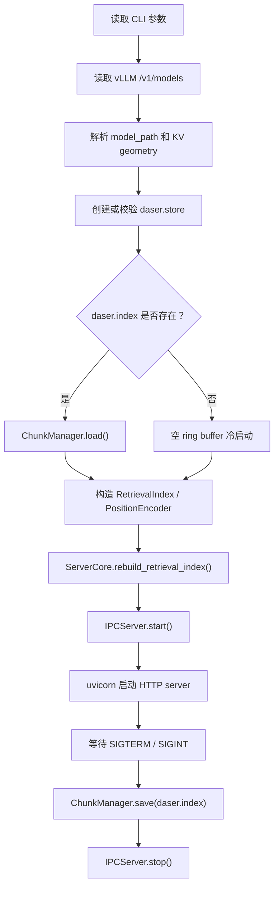

# 整体架构

DaseR 是面向 LLM 推理的 RAG-native KV cache 服务。它作为独立 DaseR
server 进程运行，通过 vLLM `KVConnectorBase_V1` 接入推理流程，把 KV
张量存放到 NVMe 上，并在控制面维护 chunk 元数据、文档注册和检索索引。

---

## 进程拓扑



`ServerCore` 是控制面唯一状态所有者。HTTP server 直接调用 `ServerCore`
处理文档和推理请求；IPC server 只暴露 connector 需要的 cache ops。

数据平面留在 vLLM worker 进程内。`cuFileBufRegister` 绑定调用进程的
CUDA context，因此 GDS DMA 必须在持有 KV cache GPU buffer 的 vLLM worker
中执行。DaseR server 不直接访问 GPU KV tensor。

---

## 启动流程

DaseR 采用 vLLM-first 启动。先启动 vLLM，只传 connector 类型和 IPC
socket path：

```bash
vllm serve /path/to/model \
    --port 8001 \
    --no-enable-prefix-caching \
    --kv-transfer-config '{"kv_connector":"DaserConnector","kv_connector_module_path":"daser.connector.daser_connector","kv_role":"kv_both","kv_connector_extra_config":{"socket_path":"/tmp/daser.sock"}}'
```

再启动 DaseR：

```bash
python -m daser.server \
    --vllm-base-url http://127.0.0.1:8001 \
    --store-dir /path/to/daser-state \
    --store-size 10gb \
    --socket-path /tmp/daser.sock \
    --host 0.0.0.0 \
    --port 8080
```

启动时 DaseR 会：

1. 通过 vLLM `/v1/models` 读取 served model id。
2. 从本地模型 `config.json` 推导 KV geometry 和 slot size；如果 served
   model id 不是本地目录，需要显式传 `--model-path`。
3. 创建或校验 `<store-dir>/daser.store`，容量按完整 slot 向下取整。
4. 从 `<store-dir>/daser.index` 恢复 metadata，并重建 `RetrievalIndex`。
5. 在同一进程中启动 HTTP server 和 IPC server。

`store_path`、`slot_size`、`block_tokens`、`model_id` 等运行时配置由 DaseR
server 持有。vLLM connector 启动后通过 IPC op `get_runtime_config` 拉取，
避免 vLLM 参数和 DaseR 参数重复传递后不一致。

---

## API 边界

### HTTP server

HTTP server 面向用户和上层应用：

| Method | Path | 用途 |
|--------|------|------|
| `GET` | `/health` | DaseR 和 vLLM 健康状态 |
| `POST` | `/documents` | 上传文档，切 chunk，触发 vLLM prefill 并注册文档 |
| `GET` | `/documents` | 列出文档 |
| `GET` | `/documents/{doc_id}` | 查询单个文档元数据 |
| `DELETE` | `/documents/{doc_id}` | 删除文档并释放 chunk 引用 |
| `POST` | `/infer` | 基于指定 docs 和 task 组 prompt 并调用 vLLM completion |

HTTP server 不通过 IPC 自连；它直接调用 `ServerCore` 的文档和 lookup
接口，并通过 `VLLMClient` 调用 vLLM OpenAI-compatible HTTP API。

### IPC server

IPC server 面向 vLLM `DaserConnector`：

| op | 请求字段 | 响应字段 |
|----|----------|----------|
| `get_runtime_config` | - | `runtime_config` |
| `lookup` | `tokens`, `model_id` | `chunks` |
| `match_and_alloc` | `tokens`, `chunk_key`, `model_id` | `chunks`, `alloc` |
| `alloc_chunk` | `chunk_key`, `token_count`, `model_id` | `start_slot`, `num_slots`, `file_offset`, `pos_offset` |
| `commit_chunk` | `chunk_key` | `ok` |
| `commit_l1` | `chunk_key` | `ok` |
| `commit_l2` | `chunk_key` | `ok` |
| `release_chunks` | `chunk_keys` | `ok` |
| `evict_l1` | `chunk_key` | `ok` |
| `evict_chunk` | `chunk_key` | `ok` |

IPC server 不提供文档管理 op。文档生命周期只属于 HTTP server 和
`ServerCore`。

---

## 关键设计决策

### HTTP server 和 IPC server 共用 ServerCore

两个 server 在同一 DaseR 进程中运行，并共享同一个 `ServerCore` 实例。
这样 HTTP 上传文档产生的 chunk、IPC 分配的 slot、关机保存的 metadata
都落在同一份控制面状态上。

### 两阶段提交

`alloc_chunk` 只预留 slot 和 metadata，不把 chunk 插入 `RetrievalIndex`。
vLLM worker 完成 KV 写入后调用 `commit_chunk`，chunk 才对 lookup 可见。
这避免了部分写入的数据被其他请求读到。

`iouring-mem` transfer backend 使用 write-back L1 语义：worker 完成
GPU→pinned host L1 拷贝后调用 `commit_l1`，chunk 进入 `l1_only` 并可被
lookup；后台 SSD L2 写完后调用 `commit_l2`，chunk 进入 durable 状态。
`l1_only` chunk 在 L2 durable 前带 durable pin，不能被 L1 LRU 淘汰。

### Worker 侧批量 staging

store 路径不再每层单独发一次写 IO。Worker 在 forward pass 中把所有待保存
blocks 的每层 KV 拷入一个 slot-major staging tensor，`wait_for_save` 再构造
连续写 spans，提交 coalesced GDS writes，写完后统一 commit。

load 路径在 `start_load_kv` 中为每个命中 chunk 分配整块 staging tensor，
一次读回该 chunk 的所有层和 blocks，再按层批量拷回 vLLM KV cache。
`wait_for_layer_load` 是 no-op，以兼容 vLLM FULL CUDA graph 模式。

### 后台 asyncio IO loop

vLLM worker 线程不直接运行可重入 event loop。WORKER role 在初始化时创建
`daser-io` 后台线程，所有 GDS coroutine 和 async IPC commit 都通过
`run_coroutine_threadsafe` 提交。

### Transfer backend 启动后不可切换

`--transfer-backend` 由 DaseR server 持有并通过 `runtime_config` 下发给
connector。worker 初始化一个 transfer backend，之后不做运行时切换：

| Backend | 条件 | 数据路径 |
|---------|------|---------|
| `gds` | 默认；kvikio direct 或 compat | GPU ↔ NVMe 直接 DMA，或 kvikio compat staging |
| `iouring-mem` | `--l1-cache-size > 0` | GPU ↔ pinned host L1，SSD L2 通过 io_uring-compatible engine |

`gds` backend 内部仍根据 `kvikio.defaults.get("compat_mode")` 选择 cuFile
direct path 或 compat path。

### Cache reuse mode

`--cache-reuse-mode prefix` 使用 `PrefixHashIndex + FixedOffsetEncoder`，
保持精确前缀复用。`--cache-reuse-mode chunk` 使用
`ChunkReuseIndex + ChunkPositionEncoder`，用于 block-aligned 文档 chunk
复用。

---

## 启动与关机


