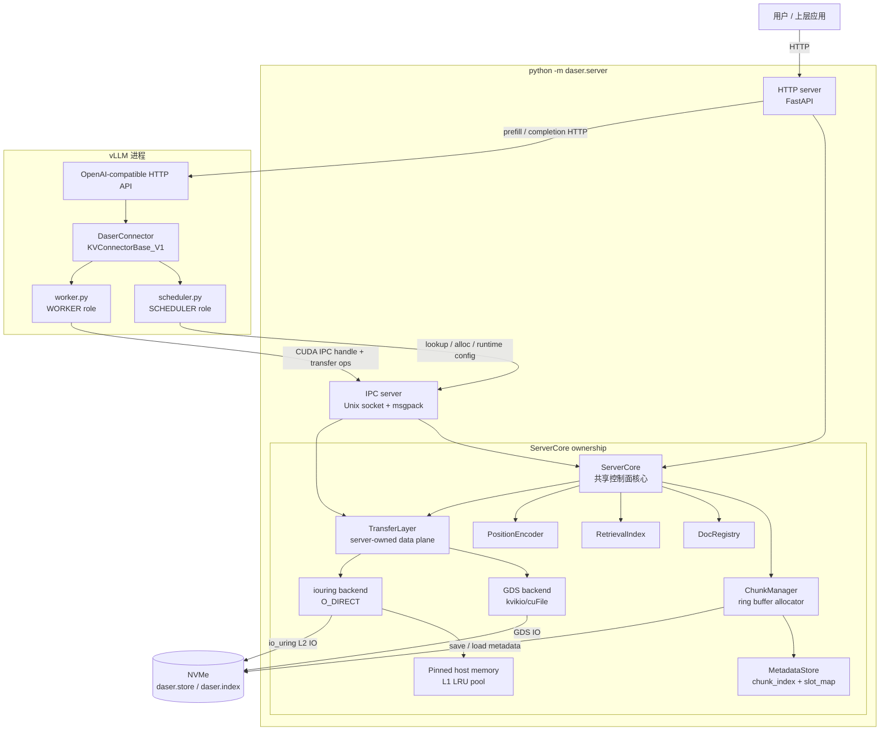
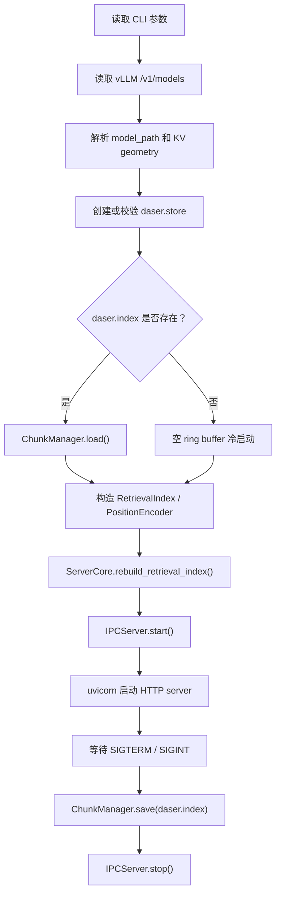

# 整体架构

DaseR 是面向 LLM 推理的 RAG-native KV cache 服务。它作为独立 DaseR
server 进程运行，通过 vLLM `KVConnectorBase_V1` 接入推理流程，把 KV
张量存放到 NVMe 上，并在控制面维护 chunk 元数据、文档注册和检索索引。

---

## 进程拓扑



`ServerCore` 是控制面唯一状态所有者。HTTP server 直接调用 `ServerCore`
处理文档和推理请求；IPC server 只暴露 connector 需要的 cache ops。

数据平面由 DaseR server 管理。vLLM worker 不打开 SSD 文件，也不选择具体
transfer backend；它只把临时 staging tensor 通过 CUDA IPC handle 暴露给
server。server 打开该 handle 后执行 GDS 或 iouring transfer，并
统一管理 SSD、L1/L2 容量和替换策略。

---

## 启动流程

DaseR 采用 vLLM-first 启动。先启动 vLLM，只传 connector 类型和 IPC
socket path：

```bash
vllm serve /path/to/model \
    --port 8001 \
    --no-enable-prefix-caching \
    --kv-transfer-config '{"kv_connector":"DaserConnector","kv_connector_module_path":"daser.connector.daser_connector","kv_role":"kv_both","kv_connector_extra_config":{"socket_path":"/tmp/daser.sock"}}'
```

再启动 DaseR：

```bash
python -m daser.server \
    --vllm-base-url http://127.0.0.1:8001 \
    --store-dir /path/to/daser-state \
    --l2-size 10gb \
    --transfer-mode gds \
    --socket-path /tmp/daser.sock \
    --host 0.0.0.0 \
    --port 8080
```

启动时 DaseR 会：

1. 通过 vLLM `/v1/models` 读取 served model id。
2. 从本地模型 `config.json` 推导 KV geometry 和 slot size；如果 served
   model id 不是本地目录，需要显式传 `--model-path`。
3. 创建或校验 `<store-dir>/daser.store`，容量按完整 slot 向下取整。
4. 从 `<store-dir>/daser.index` 恢复 metadata，并重建 `RetrievalIndex`。
5. 在同一进程中启动 HTTP server 和 IPC server。

`store_path`、`slot_size`、`block_tokens`、`model_id`、`transfer_mode`、
`l1_size_bytes`、`l2_size_bytes` 等运行时配置由 DaseR server 持有。
vLLM connector 启动后通过 IPC op `get_runtime_config` 拉取，避免 vLLM
参数和 DaseR 参数重复传递后不一致。

---

## API 边界

### HTTP server

HTTP server 面向用户和上层应用：

| Method | Path | 用途 |
|--------|------|------|
| `GET` | `/health` | DaseR 和 vLLM 健康状态 |
| `POST` | `/documents` | 上传文档，切 chunk，触发 vLLM prefill 并注册文档 |
| `GET` | `/documents` | 列出文档 |
| `GET` | `/documents/{doc_id}` | 查询单个文档元数据 |
| `DELETE` | `/documents/{doc_id}` | 删除文档并释放 chunk 引用 |
| `POST` | `/infer` | 基于指定 docs 和 task 组 prompt 并调用 vLLM completion |

HTTP server 不通过 IPC 自连；它直接调用 `ServerCore` 的文档和 lookup
接口，并通过 `VLLMClient` 调用 vLLM OpenAI-compatible HTTP API。

### IPC server

IPC server 面向 vLLM `DaserConnector`：

| op | 请求字段 | 响应字段 |
|----|----------|----------|
| `get_runtime_config` | - | `runtime_config` |
| `lookup` | `tokens`, `model_id` | `chunks` |
| `match_and_alloc` | `tokens`, `chunk_key`, `model_id` | `chunks`, `alloc` |
| `alloc_chunk` | `chunk_key`, `token_count`, `model_id` | `start_slot`, `num_slots`, `file_offset`, `pos_offset` |
| `transfer_store` | `payload`, `spans` | `ok`, `bytes` |
| `transfer_load` | `payload`, `spans` | `ok`, `bytes` |
| `commit_chunk` | `chunk_key` | `ok` |
| `evict_chunk` | `chunk_key` | `ok` |

IPC server 不提供文档管理 op。文档生命周期只属于 HTTP server 和
`ServerCore`。

---

## 关键设计决策

### HTTP server 和 IPC server 共用 ServerCore

两个 server 在同一 DaseR 进程中运行，并共享同一个 `ServerCore` 实例。
这样 HTTP 上传文档产生的 chunk、IPC 分配的 slot、关机保存的 metadata
都落在同一份控制面状态上。

### 两阶段提交

`alloc_chunk` 只预留 slot 和 metadata，不把 chunk 插入 `RetrievalIndex`。
vLLM worker 完成 KV 写入后调用 `commit_chunk`，chunk 才对 lookup 可见。
这避免了部分写入的数据被其他请求读到。

### Worker 侧 staging，server 侧 transfer

store 路径不再每层单独发一次写 IO。Worker 在 `wait_for_save` 中按容量上限
构造一个或多个 slot-major staging view，把待保存 blocks 的每层 KV 拷入
staging，导出 CUDA IPC handle，并通过 IPC 请求 server 执行 transfer。server
写完对应 batch 后，worker 再统一调用 `commit_chunk`。staging 由 worker 侧
小型 `CudaStagingPool` 复用，初始化时预分配一个 bounded buffer；单批和未完成
后台 batch 的字节上限会根据 vLLM 分配 KV cache 后的当前可用显存推导，避免
固定挤占显存。

load 路径在 `start_load_kv` 中把本 step 的命中 chunk 拆成 bounded staging
batch，导出 CUDA IPC handle，请求 server 读回 spans，再按层批量拷回 vLLM
KV cache。load 和 store 使用同一套 worker-side staging 抽象。
`wait_for_layer_load` 是 no-op，以兼容 vLLM FULL CUDA graph 模式。

### 后台 asyncio IO loop

vLLM worker 线程不直接运行可重入 event loop。WORKER role 在初始化时创建
`daser-io` 后台线程，所有 transfer IPC 和 async IPC commit 都通过
`run_coroutine_threadsafe` 提交。

### Transfer backend 启动后不可切换

`python -m daser.server --transfer-mode` 在 server 启动时选择 transfer
system，之后不做运行时切换：

| Mode | 数据路径 |
|------|---------|
| `gds` | server 打开 worker CUDA IPC staging buffer，使用 kvikio/cuFile 做 GPU ↔ NVMe 直接 DMA |
| `iouring` | server 打开 worker CUDA IPC staging buffer，SSD 作为 L2，pinned host memory 作为 L1，L1 使用 LRU；L2 使用 `O_DIRECT` io_uring，范围必须 4096-byte 对齐 |

### Cache reuse mode

`--cache-reuse-mode prefix` 使用 `PrefixHashIndex + FixedOffsetEncoder`，
保持精确前缀复用。`--cache-reuse-mode chunk` 使用
`ChunkReuseIndex + ChunkPositionEncoder`，用于 block-aligned 文档 chunk
复用。

---

## 启动与关机


