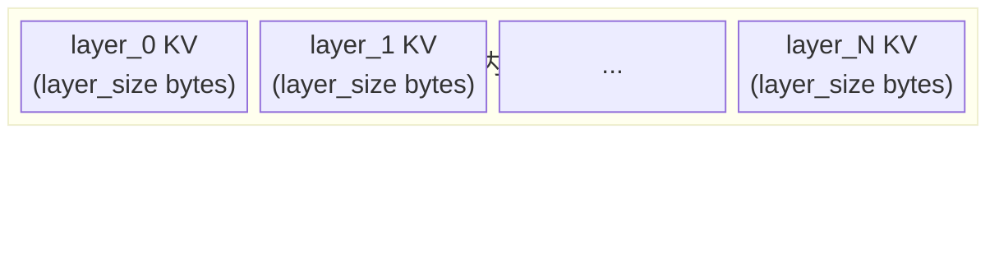

# 组件详解

## 组件职责

| 组件 | 进程 | 职责 |
|------|------|------|
| `DaserConnector` | vLLM | vLLM `KVConnectorBase_V1` 入口；保留在 `daser/connector/daser_connector.py` 供 `kv_connector_module_path` 加载 |
| `SchedulerConnectorMixin` | vLLM scheduler | `daser/connector/scheduler.py`；负责 lookup、pending load/store 跟踪、slot 分配和 connector metadata 构造 |
| `WorkerConnectorMixin` | vLLM worker | `daser/connector/worker.py`；负责 KV cache 注册、CUDA IPC handle 导出、后台 IPC loop |
| `CudaStagingPool` | vLLM worker | `daser/connector/staging.py`；负责 GDS 和 iouring 共享的 bounded slot-major GPU staging 复用 |
| `IPCClientSync` | vLLM scheduler | 阻塞式 Unix socket 客户端，用于 `get_runtime_config`、`match_and_alloc`、`alloc_chunk` |
| `IPCClientAsync` | vLLM worker | asyncio Unix socket 客户端，用于 `transfer_store`、`transfer_load`、`commit_chunk` |
| `TransferLayer` | DaseR | `daser/transfer/base.py`；server-owned KV 数据传输抽象，由 `IPCServer` 按 runtime config 初始化 |
| `GDSTransferLayer` | DaseR | `daser/transfer/gds/`；封装 kvikio cuFile / compat IO；backend 在初始化时选定，运行期不可切换 |
| `TieredIOUringTransferLayer` | DaseR | `daser/transfer/iouring/`；L1 pinned-memory + L2 SSD transfer，L1 使用 LRU replacement |
| `ReplacementPolicy` | DaseR | `daser/replacement/`；通用替换策略抽象，当前实现为 `LRUReplacementPolicy` |
| `python -m daser.server` | DaseR | CLI 入口；解析配置，构造 `ServerCore`，启动 HTTP server 和 IPC server，关机保存 index |
| `HTTP server` | DaseR | `daser/server/http/`；FastAPI routes、tokenize/chunk、vLLM HTTP 调用、文档 API 和 `/infer` |
| `IPCServer` | DaseR | `daser/server/ipc/server.py`；Unix socket lifecycle、msgpack framing、connector op dispatch |
| `ServerCore` | DaseR | 共享控制面核心；管理 chunk、doc、retrieval、position 状态 |
| `ChunkManager` | DaseR | ring buffer slot 分配、淘汰、引用计数和持久化 |
| `MetadataStore` | DaseR | `chunk_index` 和 `slot_map` 内存状态 |
| `DocRegistry` | DaseR | `doc_id -> DocEntry` 文档状态 |
| `RetrievalIndex` | DaseR | cache lookup 抽象；当前实现为 `PrefixHashIndex` 和 `ChunkReuseIndex` |
| `PositionEncoder` | DaseR | position offset 抽象；当前实现为 `FixedOffsetEncoder` 和 `ChunkPositionEncoder` |

---

## 控制面状态边界

`ServerCore` 是 HTTP server 和 IPC server 共享的控制面协调器。它本身不做
KV bytes 的 load/store，而是把请求分发给更窄的组件：slot 分配交给
`ChunkManager`，metadata 查询和持久化状态交给 `MetadataStore`，文档生命周期
交给 `DocRegistry`，cache lookup 交给 `RetrievalIndex`，position offset 交给
`PositionEncoder`。

`ChunkManager` 和 `MetadataStore` 刻意保持分离。`MetadataStore` 是纯状态容器，
保存 `chunk_key -> ChunkMeta` 的 `chunk_index` 和 `slot_id -> SlotEntry` 的
`slot_map`，并负责这部分状态的 msgpack 序列化。`ChunkManager` 是 ring-buffer
allocator，维护 head/tail，处理 wrap-around skip block、自动淘汰、引用计数联动
和完整 index save/load。也就是说，`MetadataStore` 描述“现在有哪些 chunk 以及
占哪些 slot”，`ChunkManager` 决定“下一次应该写到哪里以及需要淘汰谁”。

`DocRegistry` 记录用户文档视角的状态：`doc_id`、title、原始 token 数、
chunk 列表和每个 chunk 是否仍被 cache 命中。`ChunkManager` 只关心 KV store
里的 slot 资源；当 chunk 被淘汰时，它通知 `DocRegistry` 更新文档的 cached mask。
因此一个是文档目录，一个是 KV ring buffer allocator，二者不能合并。

iouring transfer 的 L1 状态不进入 `MetadataStore`。L1 是
`TieredIOUringTransferLayer` 进程内的 pinned-memory 热缓存，按 byte range 维护
命中表和 LRU `ReplacementPolicy`；它是可丢失的加速层，重启后可以从 L2
`daser.store` 重新填充。L2/ring-buffer metadata 才需要随 `daser.index` 持久化。

---

## 存储布局

DaseR 在 `--store-dir` 下维护两个文件：

- `daser.store`：固定 slot 大小的 KV 数据文件。
- `daser.index`：msgpack metadata 快照，关机保存、启动恢复。


每个 slot 保存一个 vLLM KV block 的所有层：



slot size 从模型 `config.json` 推导：

```text
slot_size = num_kv_heads * head_dim * 2 * num_layers * block_tokens * dtype_bytes
```

文件偏移：

```text
slot_offset(slot_i) = slot_i * slot_size
layer_offset(slot_i, layer_idx) = slot_i * slot_size + layer_idx * layer_size
```

`slot_map` 记录每个 slot 的状态：

- `chunk`：chunk 的首 slot，保存 chunk_key 和 num_slots。
- `cont`：chunk 的后续 slot。
- `skip`：wrap-around 时用于填充文件尾部碎片。

---

## 可插拔接口

### RetrievalIndex

```python
class RetrievalIndex(ABC):
    async def lookup(self, tokens: list[int], model_id: str) -> list[RetrievalMatch]: ...
    async def insert(self, meta: ChunkMeta) -> None: ...
    async def remove(self, chunk_key: str) -> None: ...
```

实现：

- `PrefixHashIndex`：从最长 block-aligned 前缀向短尝试，返回第一个精确
  hash 命中。
- `ChunkReuseIndex`：返回多个 block-aligned chunk 命中，用于文档 chunk
  复用。

### PositionEncoder

```python
class PositionEncoder(ABC):
    def assign_offset(self, chunk_key: str, token_count: int) -> int: ...
    def get_offset(self, meta: ChunkMeta) -> int: ...
```

实现：

- `FixedOffsetEncoder`：固定 offset，适合 prefix reuse。
- `ChunkPositionEncoder`：为 chunk reuse 分配和读取 chunk position offset。

`daser/server/__main__.py` 根据 `--cache-reuse-mode` 选择 retrieval 和
position 组件。`ServerCore` 只依赖 ABC。

### TransferLayer

```python
class TransferLayer(ABC):
    async def load_bytes(self, dst: Any, file_offset: int, nbytes: int) -> int: ...
    async def store_bytes(self, src: Any, file_offset: int, nbytes: int) -> int: ...
    def close(self) -> None: ...
```

实现：

- `GDSTransferLayer`：server 通过 CUDA IPC 打开 worker staging buffer，
  再用 kvikio/cuFile 在 GPU buffer 和 SSD file 之间直接传输。
- `TieredIOUringTransferLayer`：server 通过 CUDA IPC 打开 worker staging
  buffer，把 bytes 放入预分配的 pinned host L1 pool，随后异步写入 L2 SSD；
  load 时先查 L1，miss 再从 L2 读入并 promote 到 L1。L2 文件使用
  `O_DIRECT` 打开，所有 L2 offset 和 byte count 都要求 4096-byte 对齐。
  Pinned L1 pool 在 transfer 初始化时一次性分配，后续 store/load 热路径只
  lease pool slice。

connector 不感知具体 transfer 实现，只发送 `transfer_store` /
`transfer_load` IPC 请求和 CUDA IPC handle。

---

## IPC 协议

传输层为 Unix socket + 4 字节大端长度前缀 + msgpack body。Scheduler
使用同步客户端，worker 使用 async 客户端。

| op | 调用方 | 请求字段 | 响应字段 |
|----|--------|----------|----------|
| `get_runtime_config` | scheduler / worker init | - | `runtime_config` |
| `lookup` | scheduler | `tokens`, `model_id` | `chunks: list[dict]` |
| `match_and_alloc` | scheduler | `tokens`, `chunk_key`, `model_id` | `chunks`, `alloc` |
| `alloc_chunk` | scheduler | `chunk_key`, `token_count`, `model_id` | `start_slot`, `num_slots`, `file_offset`, `pos_offset` |
| `transfer_store` | worker | `payload`, `spans` | `ok: true`, `bytes` |
| `transfer_load` | worker | `payload`, `spans` | `ok: true`, `bytes` |
| `commit_chunk` | worker | `chunk_key` | `ok: true` |
| `evict_chunk` | scheduler | `chunk_key` | `ok: true` |

`runtime_config` 包含：

```json
{
  "socket_path": "/tmp/daser.sock",
  "store_path": "/path/to/daser-state/daser.store",
  "slot_size": 2359296,
  "block_tokens": 16,
  "model_id": "/path/to/model-or-served-id",
  "transfer_mode": "iouring",
  "l1_size_bytes": 1073741824,
  "l2_size_bytes": 10000000000
}
```

IPC 错误以 `{"error": "..."}` 返回，connector client 会转换为
`RuntimeError`。
