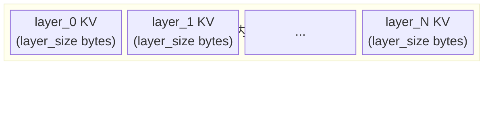

# 组件详解

## 组件职责

| 组件 | 进程 | 职责 |
|------|------|------|
| `DaserConnector` | vLLM | vLLM `KVConnectorBase_V1` 入口；保留在 `daser/connector/daser_connector.py` 供 `kv_connector_module_path` 加载 |
| `SchedulerConnectorMixin` | vLLM scheduler | `daser/connector/scheduler.py`；负责 lookup、pending load/store 跟踪、slot 分配和 connector metadata 构造 |
| `WorkerConnectorMixin` | vLLM worker | `daser/connector/worker.py`；负责 KV cache 注册、GDS load/store、后台 IO loop 和 commit |
| `IPCClientSync` | vLLM scheduler | 阻塞式 Unix socket 客户端，用于 `get_runtime_config`、`match_and_alloc`、`alloc_chunk` |
| `IPCClientAsync` | vLLM worker | asyncio Unix socket 客户端，用于 `commit_chunk` |
| `GDSTransferLayer` | vLLM worker | 封装 kvikio cuFile / compat IO；backend 在初始化时选定，运行期不可切换 |
| `python -m daser.server` | DaseR | CLI 入口；解析配置，构造 `ServerCore`，启动 HTTP server 和 IPC server，关机保存 index |
| `HTTP server` | DaseR | `daser/server/http/`；FastAPI routes、tokenize/chunk、vLLM HTTP 调用、文档 API 和 `/infer` |
| `IPCServer` | DaseR | `daser/server/ipc/server.py`；Unix socket lifecycle、msgpack framing、connector op dispatch |
| `ServerCore` | DaseR | 共享控制面核心；管理 chunk、doc、retrieval、position 状态 |
| `ChunkManager` | DaseR | ring buffer slot 分配、淘汰、引用计数和持久化 |
| `MetadataStore` | DaseR | `chunk_index` 和 `slot_map` 内存状态 |
| `DocRegistry` | DaseR | `doc_id -> DocEntry` 文档状态 |
| `RetrievalIndex` | DaseR | cache lookup 抽象；当前实现为 `PrefixHashIndex` 和 `ChunkReuseIndex` |
| `PositionEncoder` | DaseR | position offset 抽象；当前实现为 `FixedOffsetEncoder` 和 `ChunkPositionEncoder` |

---

## 存储布局

DaseR 在 `--store-dir` 下维护两个文件：

- `daser.store`：固定 slot 大小的 KV 数据文件。
- `daser.index`：msgpack metadata 快照，关机保存、启动恢复。


每个 slot 保存一个 vLLM KV block 的所有层：



slot size 从模型 `config.json` 推导：

```text
slot_size = num_kv_heads * head_dim * 2 * num_layers * block_tokens * dtype_bytes
```

文件偏移：

```text
slot_offset(slot_i) = slot_i * slot_size
layer_offset(slot_i, layer_idx) = slot_i * slot_size + layer_idx * layer_size
```

`slot_map` 记录每个 slot 的状态：

- `chunk`：chunk 的首 slot，保存 chunk_key 和 num_slots。
- `cont`：chunk 的后续 slot。
- `skip`：wrap-around 时用于填充文件尾部碎片。

---

## 可插拔接口

### RetrievalIndex

```python
class RetrievalIndex(ABC):
    async def lookup(self, tokens: list[int], model_id: str) -> list[RetrievalMatch]: ...
    async def insert(self, meta: ChunkMeta) -> None: ...
    async def remove(self, chunk_key: str) -> None: ...
```

实现：

- `PrefixHashIndex`：从最长 block-aligned 前缀向短尝试，返回第一个精确
  hash 命中。
- `ChunkReuseIndex`：返回多个 block-aligned chunk 命中，用于文档 chunk
  复用。

### PositionEncoder

```python
class PositionEncoder(ABC):
    def assign_offset(self, chunk_key: str, token_count: int) -> int: ...
    def get_offset(self, meta: ChunkMeta) -> int: ...
```

实现：

- `FixedOffsetEncoder`：固定 offset，适合 prefix reuse。
- `ChunkPositionEncoder`：为 chunk reuse 分配和读取 chunk position offset。

`daser/server/__main__.py` 根据 `--cache-reuse-mode` 选择 retrieval 和
position 组件。`ServerCore` 只依赖 ABC。

---

## IPC 协议

传输层为 Unix socket + 4 字节大端长度前缀 + msgpack body。Scheduler
使用同步客户端，worker 使用 async 客户端。

| op | 调用方 | 请求字段 | 响应字段 |
|----|--------|----------|----------|
| `get_runtime_config` | scheduler / worker init | - | `runtime_config` |
| `lookup` | scheduler | `tokens`, `model_id` | `chunks: list[dict]` |
| `match_and_alloc` | scheduler | `tokens`, `chunk_key`, `model_id` | `chunks`, `alloc` |
| `alloc_chunk` | scheduler | `chunk_key`, `token_count`, `model_id` | `start_slot`, `num_slots`, `file_offset`, `pos_offset` |
| `commit_chunk` | worker | `chunk_key` | `ok: true` |
| `evict_chunk` | scheduler | `chunk_key` | `ok: true` |

`runtime_config` 包含：

```json
{
  "socket_path": "/tmp/daser.sock",
  "store_path": "/path/to/daser-state/daser.store",
  "slot_size": 2359296,
  "block_tokens": 16,
  "model_id": "/path/to/model-or-served-id"
}
```

IPC 错误以 `{"error": "..."}` 返回，connector client 会转换为
`RuntimeError`。
