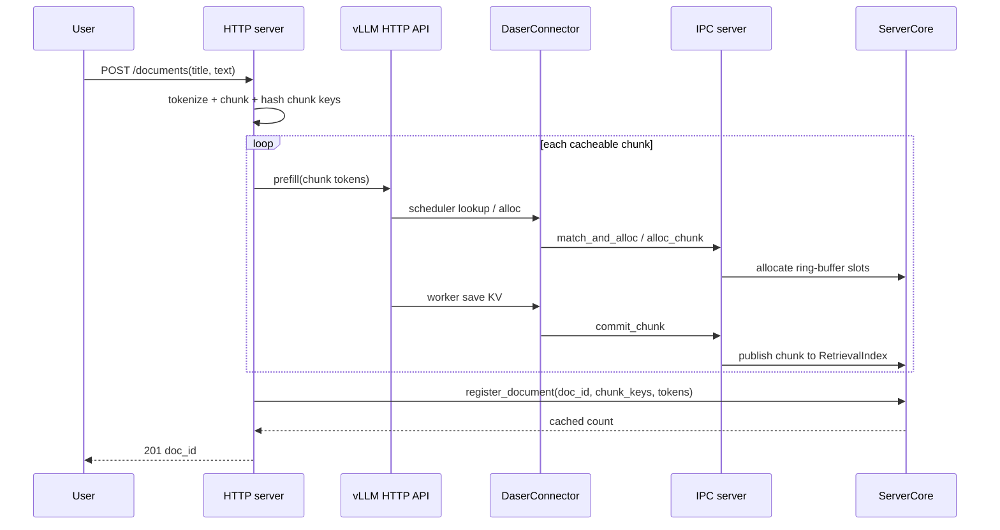
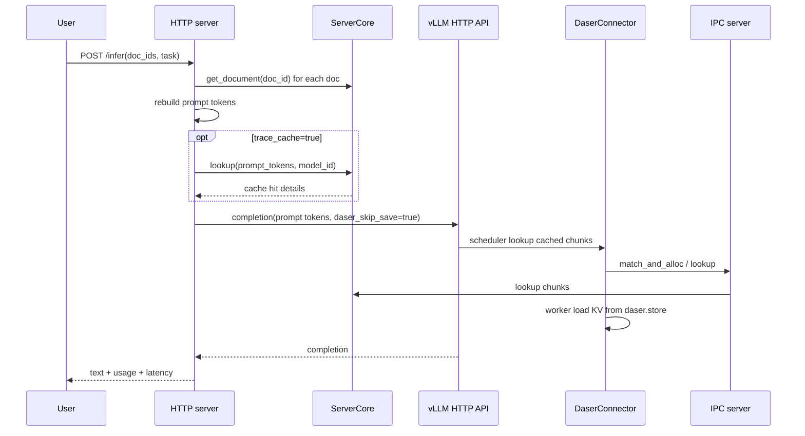
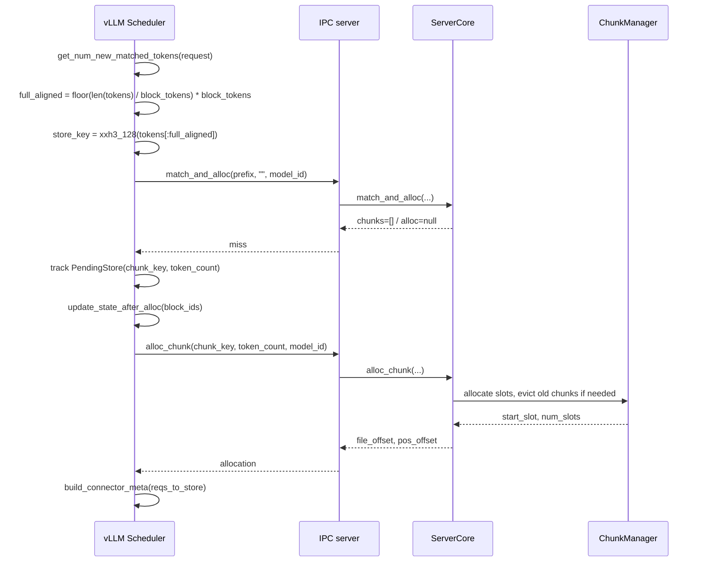
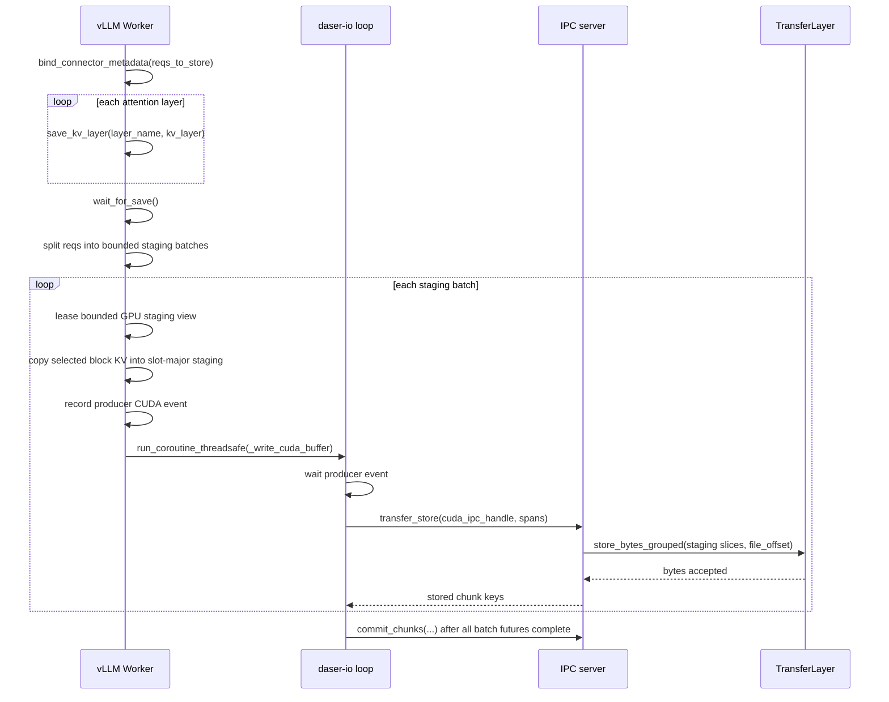
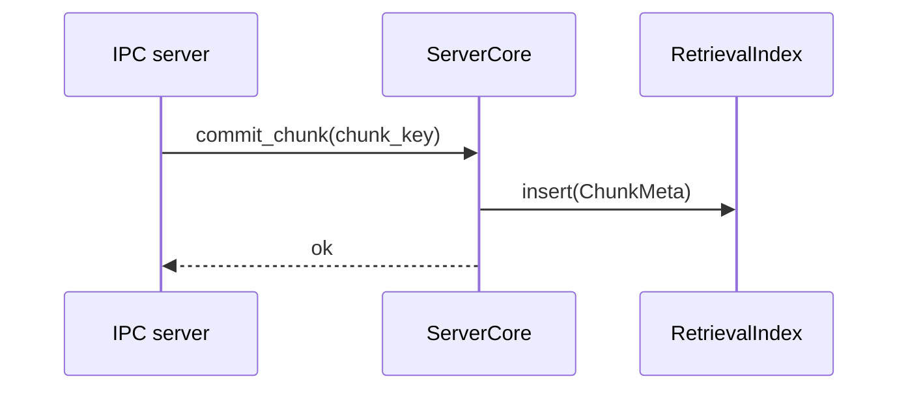
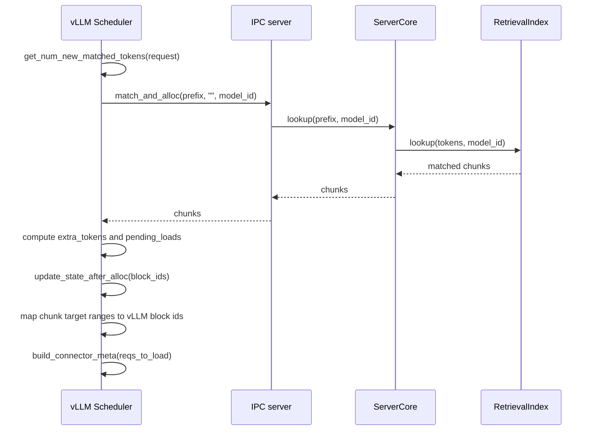
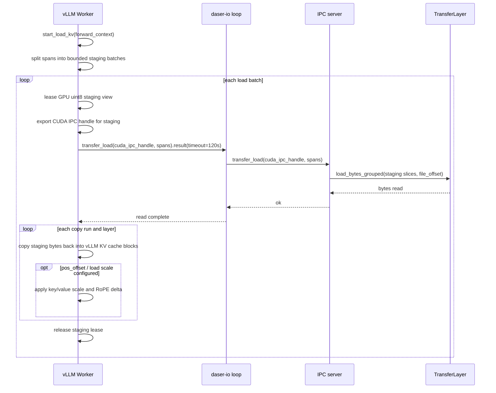
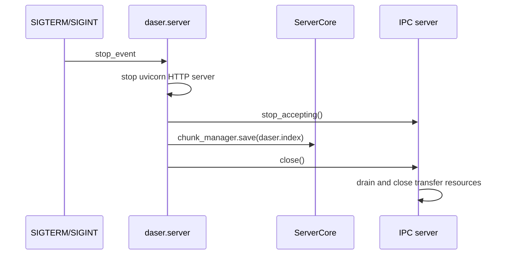

# 数据流程

## 文档上传流程

上传失败时 HTTP server 返回 `502`，不会注册文档。已经成功 commit 的 KV
chunk 可以保留在 ring buffer 中，后续相同内容仍可复用。

---

## 推理流程

`/infer` 会向 vLLM 传 `kv_transfer_params={"daser_skip_save": true}`。文档
chunk 已在上传时缓存，task suffix 通常是一次性的，因此推理请求不再把整个
拼接 prompt 重新写入 DaseR。

---

## KV Store 流程

### 阶段一：Scheduler 查找 miss 并分配 slot

`alloc_chunk` 只预留 metadata，chunk 还不会进入 `RetrievalIndex`。

### 阶段二：Worker staging 和批量写入

`wait_for_save` 在当前 worker step 内完成 KV -> staging snapshot，然后把
server transfer 交给后台 `daser-io` loop。未完成 batch 的 staging lease 由
future 持有，完成后归还 `CudaStagingPool`；`shutdown` 会阻塞等待所有 pending
store future 完成。

### 阶段三：Commit 发布

commit 完成后 chunk 才能被 lookup 命中。

---

## KV Load 流程

### 阶段一：Scheduler 查找 hit

`PrefixHashIndex` 通常返回一个最长前缀 chunk；`ChunkReuseIndex` 可以返回多个
block-aligned chunks。Scheduler 会确保返回给 vLLM 的 external tokens 是
连续可用的前缀范围。

### 阶段二：Worker 一次性加载

`start_load_kv` 返回前 KV cache 已就绪。`wait_for_layer_load(layer_name)` 是
no-op，因为 FULL CUDA graph replay 不保证逐层 Python hook 执行。

---

## 关机持久化流程

`daser.index` 保存 ring-buffer head/tail、`MetadataStore` 和 `DocRegistry`。
启动时恢复 metadata 后，`ServerCore.rebuild_retrieval_index()` 会从 committed
chunk metadata 重建检索索引。

关机采用 fast consistent stop。收到 SIGTERM/SIGINT 后，server 先停止 HTTP
和 IPC 新请求入口，再保存当时已经 commit 的 chunk metadata 和已经完成注册的
文档。connector 侧尚未完成的后台写入或尚未到达 `commit_chunk` 的数据不会进入
`daser.index`；即使底层 `daser.store` 已有部分字节，重启后也不会被检索索引命中。
已经 commit 但还没有绑定到文档的 orphan chunk 会作为普通 cache chunk 保留，
后续再次上传相同内容时可以通过相同 chunk key 复用。
