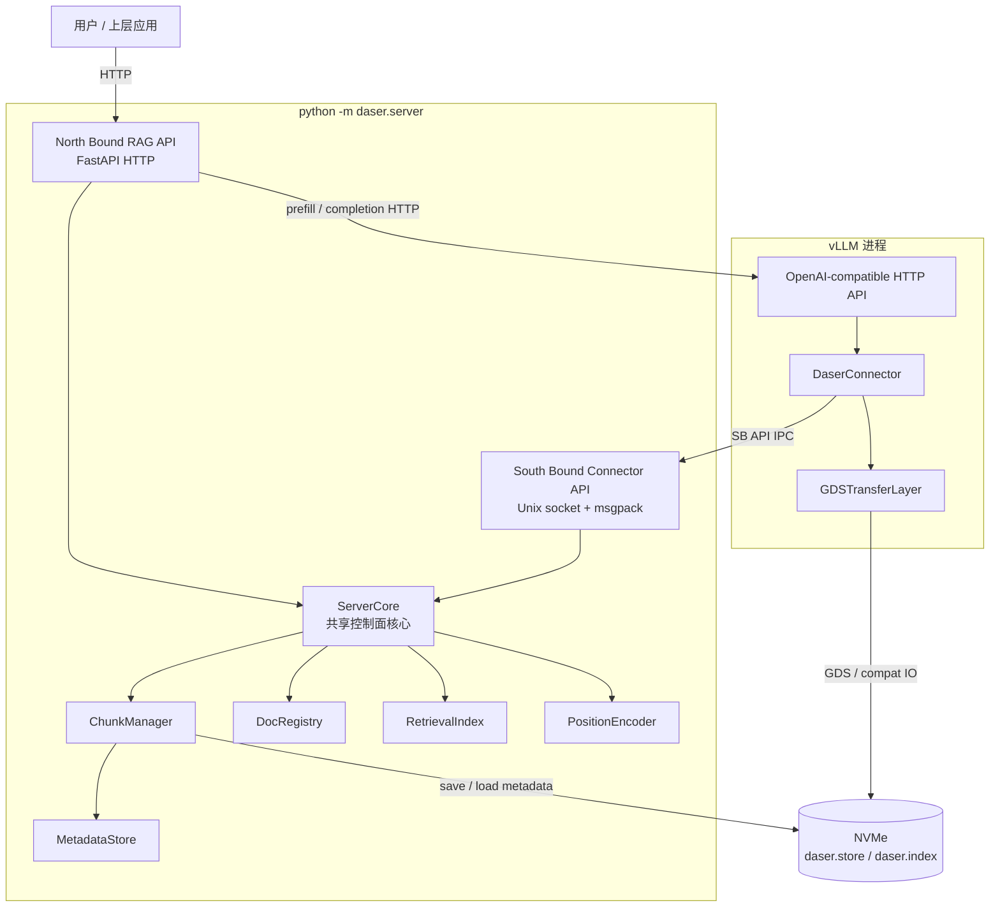
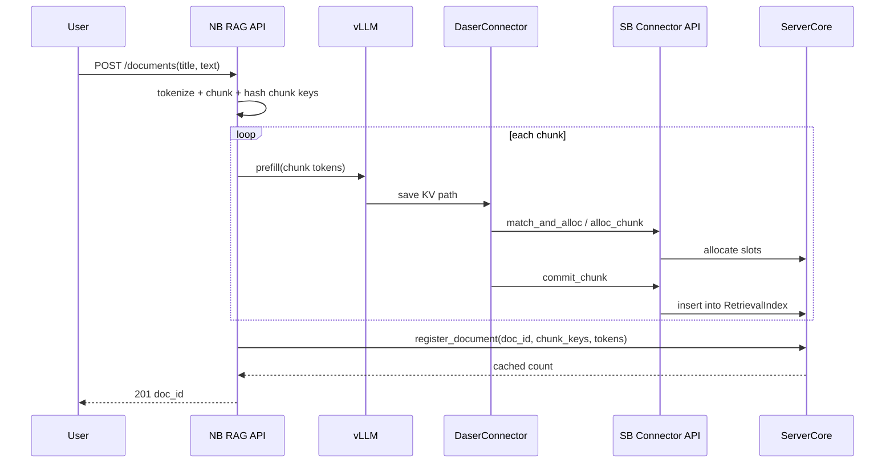
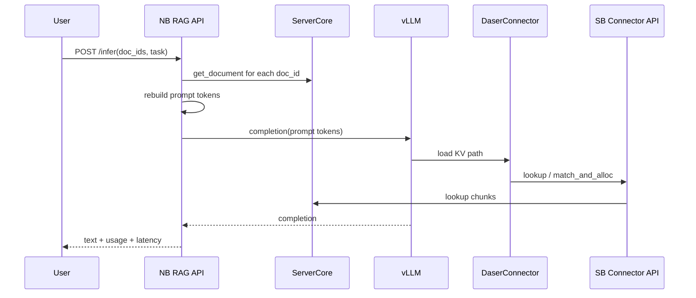

# 服务层设计

本文档描述 DaseR 的统一 server 进程。该进程同时暴露面向用户的 HTTP RAG 接口和面向 vLLM connector 的内部 IPC 接口。

---

## 目标与范围

### 目标

DaseR server 提供两类 API：

1. **North Bound RAG API (NB API)**：HTTP API，面向用户和上层应用，提供文档上传、文档列表、文档查询/删除和基于文档的推理。
2. **South Bound Connector API (SB API)**：Unix socket + msgpack IPC，面向 vLLM `DaserConnector`，提供 cache lookup、slot allocation、commit 和 evict。

### 范围外

| 项目 | 原因 |
|------|------|
| 多租户 / 权限隔离 | 单机单用户的演示服务，无需 auth |
| 语义检索 | 用户显式指定 doc_id，不需要向量检索 |
| CacheBlend / composition-aware caching | roadmap 后续贡献，本设计只保留承接边界 |
| 独立 `daser.service` 入口 | 运行时已合并到 `daser.server` |

---

## 进程拓扑



`ServerCore` 是唯一控制面状态所有者。NB API 不再通过 Unix socket 自连，而是直接调用 `ServerCore`。SB API 只保留 connector 需要的 cache ops。

---

## 启动

用户启动两个进程：

```bash
vllm serve <model-path> \
    --kv-transfer-config '{"kv_connector":"DaserConnector", ... }' \
    --port 8001

python -m daser.server \
    --host 0.0.0.0 --port 8080 \
    --vllm-base-url http://127.0.0.1:8001 \
    --model <model-path> \
    --tokenizer <model-path> \
    --store-path /path/to/daser.store \
    --store-size 10737418240 \
    --socket-path /tmp/daser.sock \
    --index-path /path/to/daser.index \
    --block-tokens 16 \
    --chunk-blocks 16
```

`--socket-path` 必须与 vLLM `DaserConnector` 配置一致。`--model` 和 `--tokenizer` 应与 vLLM 服务的模型一致。

---

## 模块职责

| 模块 | 职责 |
|------|------|
| `daser/server/__main__.py` | 解析 CLI，构造 `ServerCore`，启动 NB HTTP API 和 SB IPC API，关机保存状态 |
| `daser/server/core.py` | 控制面业务逻辑；持有 chunk、doc、retrieval、position 状态 |
| `daser/server/rag_api.py` | NB API；HTTP 路由、请求校验、tokenize、chunk、vLLM prefill/infer |
| `daser/server/connector_api.py` | SB API；Unix socket lifecycle、msgpack framing、connector op dispatch |
| `daser/server/chunker.py` | 文档 token chunks 与 chunk_key 计算 |
| `daser/server/vllm_client.py` | 调用 vLLM OpenAI-compatible HTTP API |
| `daser/server/chunk_manager.py` | 环形 slot 分配、淘汰和持久化 |
| `daser/server/doc_registry.py` | `doc_id -> DocEntry` 文档状态 |
| `daser/server/metadata_store.py` | chunk metadata 和 slot map |

---

## API 边界

### North Bound RAG API

HTTP endpoints：

| Method | Path | 用途 |
|--------|------|------|
| `GET` | `/health` | server/vLLM 健康状态 |
| `POST` | `/documents` | 上传文档，触发 chunk prefill，注册 doc |
| `GET` | `/documents` | 列出文档 |
| `GET` | `/documents/{doc_id}` | 查询单个文档元数据 |
| `DELETE` | `/documents/{doc_id}` | 删除文档并释放 chunk 引用 |
| `POST` | `/infer` | 基于指定 docs 和 task 做推理 |

NB API 直接调用 `ServerCore.register_document`、`list_documents`、`get_document` 和 `delete_document`。

### South Bound Connector API

IPC ops：

| op | 请求字段 | 响应字段 |
|----|----------|----------|
| `lookup` | `tokens`, `model_id` | `chunks` |
| `match_and_alloc` | `tokens`, `chunk_key`, `model_id` | `chunks`, `alloc` |
| `alloc_chunk` | `chunk_key`, `token_count`, `model_id` | `start_slot`, `num_slots`, `file_offset`, `pos_offset` |
| `commit_chunk` | `chunk_key` | `ok` |
| `evict_chunk` | `chunk_key` | `ok` |

SB API 不提供文档管理 op。文档操作只能通过 NB API 或 `ServerCore` 内部方法完成。

---

## 上传流程



如果某个 chunk prefill 失败，NB API 返回 502，不注册文档。已经 commit 的 chunk 可以留在 ring buffer 中供后续相同内容复用。

---

## 推理流程



---

## 错误处理

NB API：

- `400`：请求非法，例如空 `doc_ids` 或文档短于一个 chunk。
- `404`：文档不存在。
- `409`：文档存在但缺少推理所需 token 数据。
- `502`：vLLM 调用失败或控制面内部操作失败。

SB API：

- 所有错误以 msgpack dict 返回：`{"error": "..."}`。
- connector client 将 error response 转换为 `RuntimeError`。
- 未知 op 返回 `{"error": "unknown op: <op>"}`。

---

## 持久化

关机时 `ChunkManager.save(index_path)` 保存：

- ring buffer head/tail；
- `MetadataStore`；
- `DocRegistry`。

启动时恢复这些状态，并由 `ServerCore.rebuild_retrieval_index()` 从恢复的 `ChunkMeta` 重新填充 `RetrievalIndex`。
