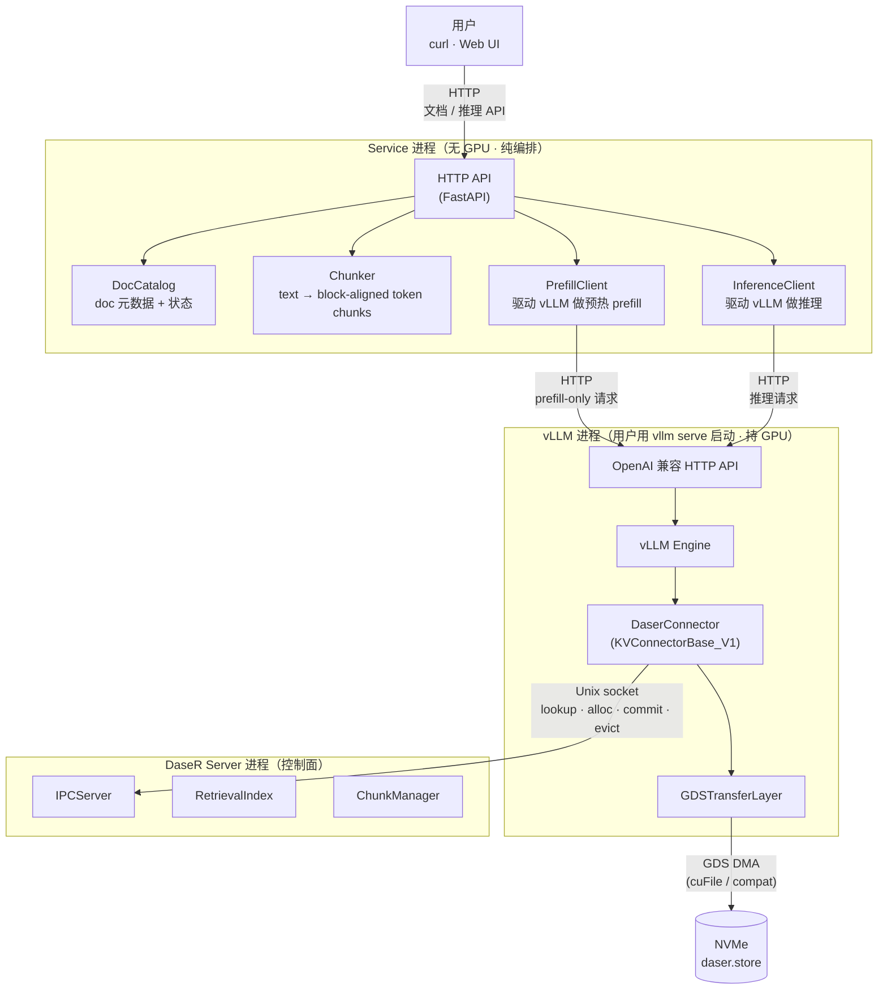
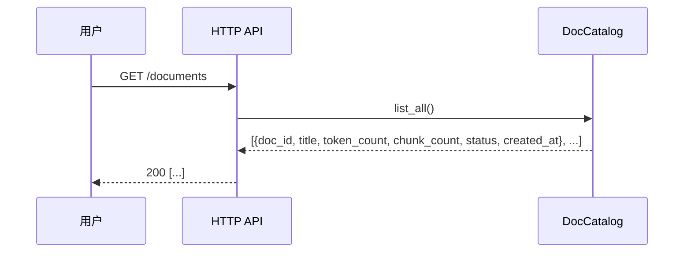
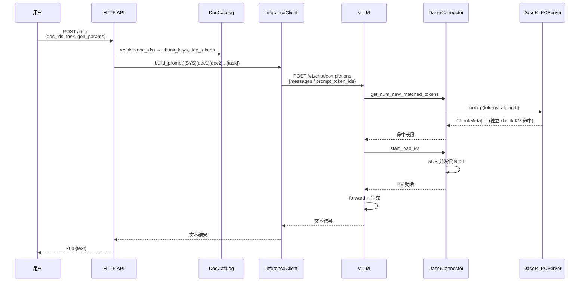

# 服务层设计

本文档描述 DaseR 项目的用户侧服务层（Service Layer）设计。服务层位于现有 KV 缓存基础设施之上，为终端用户提供文档管理与 RAG 推理能力。

---

## 一、目标与范围

### 目标

服务层是一个**演示级 RAG 服务**，对终端用户提供三类操作：

1. **上传文档** — 把文档交给系统，系统负责切块、分词、离线预计算 chunk-level KV 并写入 DaseR。
2. **列举文档** — 返回当前已注册的文档清单与状态。
3. **指定文档 + task 推理** — 用户选定一组 doc_id 与 task 提示词，服务构造 prompt 并调用 vLLM 完成推理；被选中的文档 chunk 从 DaseR 缓存中加载 KV，避免重复 prefill。

### 范围外（不做）

| 项目 | 原因 |
|------|------|
| 多租户 / 权限隔离 | 单机单用户的演示服务，无需 auth |
| 语义检索（embedding 检索 doc） | 用户显式指定 doc_id，不需要向量检索 |
| Composition-aware caching / CacheBlend | Research roadmap Contribution 2，服务层只提供承接接口，不落实现 |
| 文档跨进程热更新 | 上传后不可变；更新等于删除 + 重新上传 |

### 与 research roadmap 的关系

- 服务层**不涉及** I/O 调度（Contribution 1）——它只是上层驱动者，不触碰 `GDSTransferLayer`。
- 服务层**为** composition-aware caching（Contribution 2）**准备数据基础**：独立 chunk KV 的离线预计算、文档→chunk 的映射、组合访问的埋点接口都在这一层。
- 服务层**不做** cost-based 动态决策（Contribution 3），此类策略后续在 `ChunkManager` / 新的策略模块中实现。

---

## 二、进程拓扑

采用**独立服务 + 独立 vLLM**（Option B）：Service 是纯编排层，不持有 GPU；vLLM 由用户用 `vllm serve` 启动；DaseR Server 照旧。



### 启动顺序（用户侧）

用户需要依序启动三个进程：

```bash
# 1. DaseR 控制面
python -m daser.server \
    --store-path /path/to/daser.store \
    --socket-path /tmp/daser.sock \
    --index-path /tmp/daser.index

# 2. vLLM（配好 DaserConnector）
vllm serve <model-path> \
    --kv-transfer-config '{"kv_connector":"DaserConnector", ... }' \
    --port 8001

# 3. Service 层
python -m daser.service \
    --host 0.0.0.0 --port 8080 \
    --vllm-base-url http://127.0.0.1:8001 \
    --catalog-path /path/to/catalog.db \
    --model-id <model-id> --tokenizer <tokenizer>
```

### 为什么选这种拓扑

1. **分层清晰**：DaseR Server 守住"只管 KV 索引"的边界（CLAUDE.md Rule 5）；vLLM 守住"只管推理"；Service 守住"只管业务流"。
2. **独立重启**：Service 无状态（状态都在 DocCatalog 文件 / DaseR 索引里），重启不影响 vLLM 和 DaseR。
3. **轻依赖**：Service 不依赖 CUDA / vLLM Python 包，部署在无 GPU 节点也可。
4. **对齐现有测试**：`tests/integration/test_vllm_e2e.py` 已是"vLLM + DaseR 独立起"的模式，Service 层叠加上去即可。

---

## 三、模块组件

### 3.1 Service 进程组件

| 组件 | 职责 |
|------|------|
| `HTTP API` | FastAPI 暴露 REST 端点；请求路由；参数校验 |
| `DocCatalog` | 文档元数据存储（doc_id、标题、chunk_keys、状态、创建时间）|
| `Chunker` | 文本→token→block_tokens 对齐的 token chunk 列表 |
| `PrefillClient` | 对 vLLM 发起 prefill-only 请求（`max_tokens=0` 或类似），触发 DaserConnector 的 alloc→write→commit 链路，使 chunk KV 落盘 DaseR |
| `InferenceClient` | 对 vLLM 发起正常 completion 请求；按模板拼接 prompt |

所有模块放在 `daser/service/` 下，**不得跨层直接 import `daser/server/` 或 `daser/connector/` 私有成员**——服务层只通过 HTTP（对 vLLM）和 Unix socket（若需主动查询 DaseR，走现有 IPC 协议）与数据/控制面交互。

### 3.2 复用的组件（不改）

- `DaserConnector`（vLLM 侧）：照旧响应 vLLM 的 save/load 钩子。
- `IPCServer` / `ChunkManager` / `RetrievalIndex`：照旧处理 lookup / alloc / commit / evict，无需为服务层新增 op。
- `GDSTransferLayer`：无变化。

> **设计要点**：预热 prefill 走的是 vLLM 的正常 forward pass；DaserConnector 在 save 路径里把 KV 写入 DaseR。服务层**不需要绕过 vLLM 直接向 DaseR 写 KV**。

---

## 四、核心数据流

### 4.1 上传流程

```mermaid
sequenceDiagram
    participant U as 用户
    participant H as HTTP API
    participant C as DocCatalog
    participant K as Chunker
    participant P as PrefillClient
    participant V as vLLM (vllm serve)
    participant D as DaserConnector
    participant I as DaseR IPCServer

    U->>H: POST /documents (title, text)
    H->>C: doc_id = new_id(); 写入 pending 状态
    H->>K: chunk(text)
    K->>K: tokenize(text)<br/>按 block_tokens 对齐切 chunk
    K-->>H: [tokens_chunk_0, tokens_chunk_1, ...]

    loop 每个 chunk_i（串行或并发）
        H->>P: prefill(tokens_chunk_i)
        P->>V: POST /v1/completions<br/>{prompt_token_ids, max_tokens=0}
        V->>D: start_load_kv → miss
        V->>V: prefill chunk tokens
        V->>D: save_kv_layer / wait_for_save
        D->>I: alloc_chunk → commit_chunk
        I-->>D: ok
        D-->>V: done
        V-->>P: 200 OK
        P-->>H: chunk_key = SHA256(tokens_chunk_i)
    end

    H->>C: 写入 {doc_id, chunk_keys=[...], 状态=ready}
    H-->>U: 201 {doc_id}
```

**关键点**：
- `chunk_key = SHA256(tokens_chunk_i)` 与 DaseR 的 `PrefixHashIndex` key 一致，保证上传登记的 chunk 就是推理时被命中的 chunk。
- 每个 chunk **独立** prefill（不拼前缀），对应"独立 chunk KV（CacheBlend 式）"的预计算语义。
- DocCatalog 先写 `pending`，最后转 `ready`；若中途失败则留 `failed` 状态，支持幂等重试。

### 4.2 列举流程



列举完全走本地 Catalog，无需触达 vLLM / DaseR。

### 4.3 推理流程



> 独立 chunk KV 命中后，vLLM 加载的 KV **不含交叉注意力**；这对当前 demo 足够（定性验证流水线），精修由后续 CacheBlend / composition-aware caching 处理。

---

## 五、文档分块策略

分块是服务层的核心决策，直接影响 DaseR 缓存命中率。

**规则（初版）**：

1. 用 tokenizer 把文档文本转成 `token_ids`。
2. 按 `block_tokens`（与 vLLM / DaseR 一致，默认 16）对齐切块；**不足一个 block 的尾部 token 丢弃或填到下一个 chunk**——具体策略待定。
3. 每个 chunk 固定为 `N × block_tokens` 个 token（`N` 为可配置的每 chunk 块数；初版建议 `N = chunk_tokens / block_tokens`）。
4. `chunk_key = SHA256(tokens_chunk_i)` —— 与 DaseR 现有 `PrefixHashIndex` 完全对齐。

**待迭代**（见第八节）：语义切块、跨句不截断、markdown/heading 感知、chunk_tokens 大小选择、尾部 token 处理。

---

## 六、文档元数据持久化

`DocCatalog` 存储以下字段：

```python
@dataclass
class DocRecord:
    doc_id: str            # uuid4
    title: str
    created_at: float
    token_count: int
    chunk_keys: list[str]  # 与 DaseR 的 chunk_key 对应
    status: str            # "pending" | "ready" | "failed"
    error: str | None      # 失败原因
```

**存储后端（初版）**：SQLite 单文件（`catalog.db`）。足够简单，支持并发读，且便于演示环境迁移。

**与 DaseR 状态不同步的处理**：DaseR 环形 buffer 可能驱逐已登记的 chunk（ring wrap-around）。服务层不主动维护同步；若推理时发现部分 chunk 未命中，vLLM 会正常 prefill 并让 DaserConnector 重新写入（cache miss 优雅降级）。DocCatalog 的 `chunk_keys` 永远只是"曾经登记过"的凭证。

---

## 七、HTTP API（初稿 · 待迭代）

> 端点形状、请求/响应 schema 的细节将在本节持续迭代。初稿给出骨架。

### 7.1 端点一览

| 方法 | 路径 | 说明 |
|------|------|------|
| `POST` | `/documents` | 上传一个文档 |
| `GET` | `/documents` | 列举所有文档 |
| `GET` | `/documents/{doc_id}` | 单个文档详情 |
| `DELETE` | `/documents/{doc_id}` | 删除文档（调 DaseR `evict_chunk`）|
| `POST` | `/infer` | 指定 doc_ids + task 做推理 |
| `GET` | `/health` | 健康检查（含 vLLM / DaseR 可达性）|

### 7.2 请求/响应 schema（初稿）

**POST `/documents`**

```json
// Request
{
  "title": "string",
  "text": "string"
}
// Response 201
{
  "doc_id": "uuid",
  "status": "pending"
}
```

**GET `/documents`**

```json
// Response 200
[
  {
    "doc_id": "uuid",
    "title": "string",
    "token_count": 1234,
    "chunk_count": 8,
    "status": "ready",
    "created_at": 1690000000.0
  }
]
```

**POST `/infer`**

```json
// Request
{
  "doc_ids": ["uuid", "uuid"],
  "task": "Summarize the above documents.",
  "gen_params": {
    "max_tokens": 256,
    "temperature": 0.7
  }
}
// Response 200
{
  "text": "string",
  "prompt_tokens": 5120,
  "completion_tokens": 256,
  "cache_hit_chunks": 16
}
```

### 7.3 待细化

- 是否支持流式返回（SSE）？
- 上传是否支持文件 multipart？
- `gen_params` 的白名单 / 透传策略
- prompt 模板的可配置性
- 错误码与错误响应体

---

## 八、待决事项与开放问题

| 项目 | 问题 | 当前倾向 |
|------|------|---------|
| **预热 prefill 调用形式** | `vllm serve` 对 `max_tokens=0` 的支持与 DaserConnector 触发行为需实测；若 OpenAI API 层拦住了 max_tokens=0，需退回 `max_tokens=1` 丢弃输出 | 先走 `max_tokens=0`，测不通再退回 |
| **Chunker 策略** | 是否跨句截断？markdown 感知？chunk_tokens 大小？尾部不足处理？| 初版最朴素：按 `chunk_tokens = N × block_tokens` 硬切，尾部丢弃 |
| **token prefix 对齐** | DaseR `PrefixHashIndex` 在 `alloc_chunk` 时 key 为 `SHA256(tokens_chunk)`；但 `lookup` 用 `SHA256(tokens[:aligned])`。预热时 chunk 单独 prefill，推理时是拼接 prompt，两者 key 不自然一致 | 需确认 key 计算口径或调整预热/推理的 prompt 构造方式 |
| **Prompt 模板位置** | `[SYS]` 是写死还是可配置？task 前是否需要分隔符？| 初版写死，在 Service 启动参数提供覆盖 |
| **多文档顺序** | 用户给的 doc_ids 顺序直接决定 prompt 顺序，命中率受 order 影响 | 初版严格按用户给定顺序；未来靠 composition-aware caching 打破 |
| **失败恢复** | 上传中某 chunk prefill 失败：重试？整体回滚？| 初版：标记 `failed`，用户重新上传同内容可幂等 |
| **DaseR 驱逐感知** | 推理阶段部分 chunk 被驱逐后，要不要提前感知并重新预热？| 初版依赖 vLLM 的 cache miss 优雅降级，不主动感知 |
| **Web UI** | 是否随服务层一起交付？| 建议先 curl / OpenAPI UI，原生 Web UI 作后续增强 |

---

## 九、不会做的事

- **不修改 vLLM / LMCache 源码**（CLAUDE.md Rule 6）——Service 只通过 OpenAI API 与 vLLM 交互。
- **不新增 DaseR IPC op**——现有 4 个 op 足以支撑服务层需求。
- **不引入 embedding / 向量库**——用户显式指定 doc_id，不做语义检索。
- **不做 composition-aware caching 的决策逻辑**——该逻辑在 Contribution 2 实现时进入 DaseR 控制面，不属于服务层。
