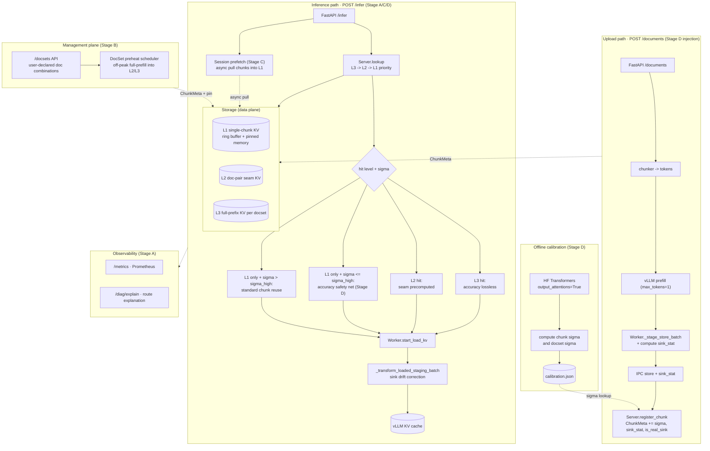

# Multi-Document Chunk Reuse Production Plan

**Date:** 2026-05-28
**Target:** turn user-managed multi-document chunk reuse into a production
service with SLA-grade cache hit ratio and bounded accuracy drift
**Scope:** `daser/server/`, `daser/connector/`, `examples/`, `docs/`

This document consolidates the project positioning, SLA targets, connector
capability boundary, staged roadmap, data model extensions, CLI flags, test
matrix, and rollback plan. No vLLM source changes are required at any stage.

## 1. Positioning

### 1.1 Value Proposition

DaseR is a KV cache service for **user-managed multi-document RAG**:

- **User contract:** the client passes explicit `doc_ids` on `/infer`. DaseR
  does not run a retrieval / semantic-similarity stage on its own.
- **Primary advantages:** cross-process / cross-restart persistence on NVMe,
  multi-document chunk concatenation, predictable cache hit ratio, and bounded
  seam-precision repair.
- **Primary metric:** **Cache Hit Ratio**, which directly determines TTFT,
  GPU prefill cost, and the user-perceived latency floor.
- **Commitment:** doc-sets that the user declares as frequently used should
  stay pinned in cache, achieve close to full hit ratio, and remain observable
  at the production-SLA level.

### 1.2 Differentiation

| Capability                                | vLLM Prefix Cache | SGLang Radix | DaseR     |
|-------------------------------------------|:-----------------:|:------------:|:---------:|
| Cross-process / restart persistence       | no                | no           | yes (NVMe) |
| Multi-document concatenation (non-prefix) | no                | partial      | yes       |
| User-explicit doc-set registration        | no                | no           | yes       |
| Hierarchical caching (L1 / L2 / L3)       | no                | no           | yes       |
| Seam-precision repair                     | no                | no           | yes       |
| Production observability and SLA          | basic             | basic        | yes       |

No open-source competitor combines explicit doc-set management with persistent
multi-document KV cache reuse.

## 2. SLA Targets

| Indicator                  | Definition                                             | Target          |
|----------------------------|--------------------------------------------------------|----------------:|
| Chunk Hit Ratio            | `chunk_hits / chunks_requested`                        | >= 95%          |
| DocSet Hit Ratio           | `docset_full_hits / total_requests` (registered sets)  | >= 80%          |
| TTFT P50 (warm)            | warm-hit TTFT median                                   | <= 50 ms        |
| TTFT P99 (warm)            | warm-hit TTFT 99th percentile                          | <= 200 ms       |
| Cold TTFT (with prefetch)  | first request in a new session after prefetch          | <= 200 ms       |
| Accuracy Drift             | chunk reuse vs full prefill task-level accuracy loss   | <= 2%           |
| Pinned Eviction Rate       | pinned chunk evictions per 1000 requests               | 0               |
| Prefetch Lead Time         | session start to prefetch completion                   | <= 3 s          |

## 3. Connector Capability Boundary

### 3.1 What the connector can do

| Capability                                    | Hook                                             | Note                                                            |
|-----------------------------------------------|--------------------------------------------------|-----------------------------------------------------------------|
| Set external-token count                      | `get_num_new_matched_tokens` returns one int     | N tokens starting from `num_computed_tokens`, must be contiguous |
| Skip load / save per request                  | `daser_skip_load` / `daser_skip_save`            | Binary request-level flags                                       |
| Mutate KV at load time                        | `_transform_loaded_staging_batch`                | K/V scaling, RoPE delta, sink correction                         |
| Extract KV at save time                       | `_stage_store_batch` plus `wait_for_save`        | Whole-chunk store keyed by `chunk_key`                           |
| Per-chunk metadata                            | `ChunkMeta`                                      | Extensible                                                       |
| Multi-chunk assembly                          | `ReqLoadSpec.chunks`                             | Must be head-to-tail contiguous, no gap                          |
| Cross-request reuse                           | `chunk_key` index                                | Already implemented                                              |

### 3.2 What the connector cannot do

- Read attention scores (QK^T or attention weights).
- Drive per-layer selective load / store.
- Express non-contiguous external supply (skip-head, reuse-middle, skip-tail)
  inside one request.
- Modify attention computation (temperature scaling, in-kernel masking, etc.).
- Share the vLLM GPU KV block allocation across requests.

### 3.3 Project constraints (CLAUDE.md)

| Constraint                                  | Plan landing point                                                |
|---------------------------------------------|-------------------------------------------------------------------|
| Control plane in server                     | DocSet manager, pin policy, calibration, metrics in `daser/server/` |
| Data plane in connector                     | Sink correction in worker; scheduler only routes                  |
| Cross-layer access via ABC / IPC only       | Scheduler reads new fields through IPC `lookup`, not server state |
| No vLLM source changes                      | All code lives in `daser/`, `examples/`, `docs/`                  |
| All I/O is asyncio                          | Prefetch and preheat run as server async tasks                    |
| Transfer mode fixed at startup              | Independent of this plan                                          |

## 4. Architecture Overview



## 5. Data Model Extensions

All new fields are `Optional` or have safe defaults so msgpack records remain
backward and forward compatible across stages.

### 5.1 `ChunkMeta` (`daser/server/metadata_store.py`)

```python
@dataclass
class ChunkMeta:
    # existing
    chunk_key: str
    start_slot: int
    num_slots: int
    token_count: int
    pos_offset: int
    model_id: str
    created_at: float
    doc_ids: list[str]

    # Stage A: observability and access tracking
    access_count: int = 0
    last_access_time: float = 0.0

    # Stage B: pinning policy
    pinned: bool = False
    docset_names: list[str] = field(default_factory=list)

    # Stage C: hierarchical cache
    cache_level: Literal["L1", "L2", "L3"] = "L1"

    # Stage D: accuracy safety net
    self_contained_score: Optional[float] = None       # sigma in [0, 1]
    sink_stat_bytes: Optional[bytes] = None             # bf16 tensor [layers, kv_heads, head_dim]
    sink_k_fs: int = 0                                  # 0 disables drift correction
    is_real_sink: bool = False                          # skip drift correction when True
```

### 5.2 `DocSetMeta` (`daser/server/docset/`, new package)

```python
@dataclass
class DocSetMeta:
    name: str
    doc_ids: list[str]
    chunk_keys: list[str]                              # ordered chunk sequence
    pinned: bool = True                                # registration pins by default
    docset_sigma: Optional[float] = None               # doc-set level sigma
    l2_chunk_keys: list[str] = field(default_factory=list)  # doc-pair seam KV
    l3_chunk_key: Optional[str] = None                 # full-prefix KV
    created_at: float = 0.0
    last_used_at: float = 0.0
```

### 5.3 `ChunkInfo` (`daser/server/core.py`)

The IPC `lookup` payload gains the same new fields. Older connectors ignore
unknown keys, which keeps the rollout out of lockstep.

### 5.4 `ReqLoadSpec` (`daser/connector/metadata.py`)

```python
@dataclass
class ReqLoadSpec:
    # existing
    ...

    cache_level: Literal["L1", "L2", "L3"] = "L1"
    sink_stat_bytes: Optional[bytes] = None
    sink_k_fs: int = 0
    is_real_sink: bool = False
```

## 6. Staged Roadmap

| Stage | Span    | Theme                                  | Direct goal                                                | Main subparts                                                 |
|:-----:|:-------:|----------------------------------------|------------------------------------------------------------|---------------------------------------------------------------|
| A     | 1-2 wk  | Production observability               | Quantify hit ratio, TTFT, accuracy drift                   | A.1 metrics, A.2 diag, A.3 baseline measurement               |
| B     | 2-3 wk  | DocSet management and pinning          | Registered doc-set hit ratio >= 80%                        | B.1 `/docsets` API, B.2 preheat, B.3 LFU+LRU, B.4 pin         |
| C     | 3-4 wk  | Hierarchical cache and session prefetch | Warm TTFT P50 <= 50 ms                                     | C.1 L2, C.2 L3, C.3 session, C.4 async load                   |
| D     | 4-6 wk  | Accuracy safety net                    | Accuracy loss on L1 fallback path <= 2%                    | D.1 sigma, D.2 sink_stat, D.3 routing, D.4 trim, D.5 drift, D.6 real-sink |
| E     | ongoing | Long-term evolution                    | Approach full-prefill accuracy                             | E.1 multi-version, E.2 distillation, E.3 online calibration, E.4 pair affinity, E.5 overlap chunking |

### Stage A · Production Observability

Stage A is a prerequisite for every later stage: without baseline numbers,
nothing else can prove a regression-free improvement.

Subparts:

- **A.1 `/metrics` Prometheus endpoint.** Exposes:

  | Metric                            | Labels                                 |
  |-----------------------------------|----------------------------------------|
  | `daser_chunk_hits_total`          | doc_id                                 |
  | `daser_chunk_misses_total`        | doc_id                                 |
  | `daser_docset_hit_ratio`          | docset_name                            |
  | `daser_cache_level_hits_total`    | level={L1, L2, L3}                     |
  | `daser_ttft_seconds`              | mode={baseline, chunk, docset} histogram |
  | `daser_eviction_total`            | reason={ring, explicit, document_delete} |
  | `daser_l1_l2_l3_size_bytes`       | level                                  |
  | `daser_accuracy_drift_estimate`   | docset_name                            |

- **A.2 `/diag/explain` endpoint.** Given a prompt and a `doc_ids` list, returns
  the routing decision, hit tier, expected TTFT, and accuracy-net flag.
- **A.3 Baseline measurement script** under `examples/baseline_measure/` to
  collect per-doc and per-docset hit-ratio and TTFT distribution over a week
  of production traffic.

Landing points:

- `daser/server/http/metrics.py` (new)
- `daser/server/http/diag.py` (new)
- `daser/server/core.py` access counters

Rollback: disabling metrics only loses observability; no behavioral change.

### Stage B · DocSet Management and Pinning

Goal: let the user declare frequently used doc-sets and have the system
guarantee a hit-ratio SLA on them.

Subparts:

- **B.1 `/docsets` API.**

  ```
  POST   /docsets                  register { name, doc_ids }
  GET    /docsets                  list registrations
  DELETE /docsets/{name}           unregister (un-pin)
  POST   /docsets/{name}/preheat   trigger preheat manually
  ```

- **B.2 Preheat scheduler.** After registration, an async task runs a full
  prefill path for each doc-set during off-peak windows, pulls all chunks into
  L1, and pins them.
- **B.3 LFU + LRU hybrid eviction.** Replaces the current LRU-only policy:

  ```
  evict_score(chunk) = alpha * (1 - normalized_access_count)
                       + (1 - alpha) * time_since_last_access
  ```

  Default `alpha = 0.7` weighs LFU higher to keep hot chunks stable.

- **B.4 Pin mechanism.** Chunks with `pinned=True` are never evicted, even
  when L1 is full; only non-pinned chunks are eligible. Doc-set registration
  pins all member chunks; unregistration unpins.

Landing points:

- `daser/server/docset/` (new package)
- `daser/server/chunk_manager.py` eviction policy
- `daser/server/http/app.py` route
- `daser/server/metadata_store.py` field extensions

Rollback: `--enable-docsets=false` returns 501 from `/docsets` and falls back
to current behavior.

### Stage C · Hierarchical Cache and Session Prefetch

Goal: drive warm TTFT down to cache-read magnitude and remove cold-start spikes.

Subparts:

- **C.1 L2 cache (doc-pair seam KV).** On doc-set registration, identify
  adjacent doc pairs, run one full-prefill that materializes the seam KV
  segment (`doc_a + doc_b`), and store the seam segment as an L2 chunk. On hit,
  the L1 chunks plus the L2 seam chunk concatenate cleanly without asking
  vLLM to re-prefill the boundary.
- **C.2 L3 cache (full-prefix KV).** One full-prefill over the entire
  registered doc-set, stored as a single chunk. On hit, no chunk assembly
  or seam prefill is needed. **Accuracy is lossless.**
- **C.3 Session state and prefetch.** HTTP header `X-Session-Id` marks the
  session. The first request triggers `prefetch_to_l1(doc_ids)` as an async
  task. Subsequent requests in the same session hit L1 almost entirely.
  Sessions expire after 10 minutes.
- **C.4 Async load.** Integrates with issue #42 so chunk reads overlap with
  vLLM scheduling instead of blocking the connector load path.

Landing points:

- `daser/server/cache/levels.py` (new): L2 / L3 indexing and lookup priority
- `daser/server/prefetch.py` (new): async prefetch scheduler
- `daser/connector/worker.py`: async prefetch hooks (shared with #42)

Rollback: each subpart has an independent flag. L2 / L3 disabled falls back to
L1 chunk reuse; session prefetch disabled falls back to synchronous load.

### Stage D · Accuracy Safety Net

**Critical scope:** Stage D applies only on the **L1 fallback path**. L3 and
L2 hits are accuracy-lossless by construction and need no repair.

**Routing change:** because `doc_ids` are user-supplied, Stage D removes the
"skip reuse" branch entirely. Routing decides only "repair vs not":

- sigma > sigma_high: standard chunk reuse (no repair).
- sigma <= sigma_high: trigger boundary trim and sink drift correction.

Subparts:

- **D.1 Offline sigma calibration.** Lives in `daser/server/calibration/`. Runs
  HF Transformers with `output_attentions=True` and computes chunk-level and
  doc-set-level sigma, writing `calibration.json`. CLI:
  `python -m daser.server.calibration --model <path> --corpus <jsonl> --out <dir>`.
- **D.2 Online sink_stat computation.** Worker `_stage_store_batch` averages
  the K of the first `k_fs` tokens of each chunk per layer and submits the
  result alongside the IPC store request. **Math note:** RoPE's fixed-delta
  rotation is a linear operator, so `RoPE_delta(mean_j K[j]) = mean_j(RoPE_delta(K[j]))`.
  This means the cache-time-domain mean rotated by the same delta at load
  time equals the load-time-domain mean. No NoPE inverse rotation is needed.
- **D.3 Routing decision (scheduler).** Aggregates doc-set sigma falling back
  to per-chunk `min(sigma)` to decide whether to engage the repair path.
- **D.4 Boundary trim (scheduler).** Cedes the first `k_head` and last
  `k_tail` tokens of the loaded prefix to vLLM prefill. Only whole-prefix
  single-sided trim is feasible: `_contiguous_prefix_tokens` forbids gaps,
  so per-chunk two-sided trim is **not** achievable at this layer.
- **D.5 Sink drift correction (worker).** Inside `_transform_loaded_staging_batch`,
  after the existing RoPE delta rotation, apply `K[:k_fs] -= lambda * RoPE_delta(sink_stat)`
  for non-real-sink chunks.
- **D.6 Real-Sink marker.** System-prompt chunks set `is_real_sink=True` so
  D.5 skips them; they are the true attention sink and must remain unchanged.

Landing points:

- `daser/server/calibration/` (new)
- `daser/connector/worker.py::_stage_store_batch`
- `daser/connector/scheduler.py::get_num_new_matched_tokens`
- `daser/connector/staging.py::_transform_loaded_staging_batch`
- `daser/server/http/app.py`: `/documents` accepts an `is_real_sink` flag

Rollback: `--enable-cross-attn-fix=false` short-circuits all D subparts.

### Stage E · Long-Term Evolution

| Id  | Theme                                | Replaces / extends         | Note                                                                 |
|:---:|--------------------------------------|----------------------------|----------------------------------------------------------------------|
| E.1 | Context-conditioned multi-version    | extends Stage D `chunk_key` | Cache different versions of the same chunk keyed by upstream-context hash |
| E.2 | KV residual distillation             | replaces D.5               | Learn a small residual correction model with better accuracy than heuristic sink reduction |
| E.3 | Online streaming calibration         | replaces D.1               | Sample shadow full-prefills at inference time and update sigma via EMA |
| E.4 | Chunk-pair affinity                  | strengthens D.3            | Use doc-pair co-occurrence statistics in routing                     |
| E.5 | Overlap-aware chunking               | replaces D.4               | Chunker emits overlapping chunks so vLLM trim is not needed          |

E items are research bets, not committed scope.

## 7. CLI Configuration

`python -m daser.server` gains the following flags (all default off; the
service is byte-compatible with master when no new flag is set).

| Flag                           | Default                              | Stage | Purpose                                          |
|--------------------------------|--------------------------------------|:-----:|--------------------------------------------------|
| `--enable-docsets`             | `false`                              | B     | Enable the `/docsets` API                        |
| `--enable-cache-l2`            | `false`                              | C     | Enable doc-pair seam (L2) cache                  |
| `--enable-cache-l3`            | `false`                              | C     | Enable full-prefix (L3) cache                    |
| `--enable-session-prefetch`    | `false`                              | C     | Enable session-level prefetch                    |
| `--enable-cross-attn-fix`      | `false`                              | D     | Enable accuracy safety net                       |
| `--session-timeout-seconds`    | `600`                                | C     | Session-state expiry                             |
| `--lfu-weight`                 | `0.7`                                | B     | LFU weight in the hybrid eviction score          |
| `--cross-attn-calibration`     | `${store-dir}/calibration.json`      | D     | Calibration file path                            |
| `--cross-attn-sigma-default`   | `0.7`                                | D     | Fallback sigma when calibration is missing       |
| `--cross-attn-sigma-high`      | `0.8`                                | D     | High self-containment threshold                  |
| `--cross-attn-k-head`          | `8`                                  | D     | Whole-prefix head trim length                    |
| `--cross-attn-k-tail`          | `4`                                  | D     | Whole-prefix tail trim length                    |
| `--cross-attn-sink-k-fs`       | `4`                                  | D     | Per-chunk head sink window                       |
| `--cross-attn-sink-lambda`     | `0.4`                                | D     | Drift correction coefficient                     |
| `--enable-metrics`             | `false`                              | A     | Serve Prometheus metrics at `/metrics` on the main HTTP server |

## 8. Test Matrix

### 8.1 Unit tests

| Module                                          | Cases                                                              |
|-------------------------------------------------|--------------------------------------------------------------------|
| `metadata_store`                                | Old/new ChunkMeta msgpack roundtrip; DocSetMeta serialization      |
| `chunk_manager`                                 | LFU+LRU eviction ordering; pinned chunks resist eviction           |
| `docset`                                        | Register / unregister / preheat lifecycle; concurrent registration |
| `cache.levels`                                  | L3 -> L2 -> L1 lookup priority                                     |
| `prefetch`                                      | Session state management; timeout cleanup                          |
| `calibration`                                   | Synthetic attention matrix -> known sigma                          |
| `worker._stage_store_batch`                     | sink_stat numerics correct; `is_real_sink` skips computation       |
| `scheduler`                                     | Sigma binary routing; trim leaves chunks contiguous; min(sigma) aggregation |
| `staging._transform_loaded_staging_batch`       | Behavior preserved when sink_stat=None or lambda=0; numeric oracle |

### 8.2 Integration tests

| Scenario                                                 | Expected                                                |
|----------------------------------------------------------|---------------------------------------------------------|
| All stage flags off                                      | Byte-identical to master                                |
| Doc-set registered and preheated, then served            | L3 hit, TTFT visibly lower                              |
| Repeated requests inside one session                     | First triggers prefetch; later requests are L1 hits     |
| Pinned chunks under L1 pressure                          | Non-pinned chunks evicted first                         |
| L1 fallback with sigma <= sigma_high                     | Triggers trim and drift correction                      |
| Real-Sink chunk                                          | K[:k_fs] matches the no-correction baseline             |

### 8.3 Performance and accuracy regression

- **TTFT baseline:** master vs each cumulative stage, reporting P50 / P99.
- **Hit ratio:** master vs Stage B and C cumulatively.
- **Accuracy:** CMRC2018 and a LongBench subset, all-on vs all-off vs
  full-prefill baseline; loss <= 2%.
- **Observability:** 100% metric coverage of new code paths; alert
  thresholds verified.

## 9. Risks and Rollback

| Risk                                                          | Mitigation                                                                                       |
|---------------------------------------------------------------|--------------------------------------------------------------------------------------------------|
| Too many registered doc-sets exceed L1 capacity               | `/docsets` registration checks `chunk_count * slot_size < l1_capacity * 0.8`                     |
| Session prefetch competes with foreground requests for GPU    | Prefetch runs outside `--gpu-memory-utilization`; paused under load                              |
| L3 invalidation when a doc in a doc-set is updated            | Doc-update events cascade-invalidate dependent L3 entries; next request re-preheats              |
| Calibration drift vs production model weights                 | Sigma is a ratio of attention shares; model fingerprint stored alongside calibration             |
| Drift correction degrades decode-time KV                      | End-to-end accuracy regression is the safety net; lambda default is conservative                 |
| Boundary trim splits a chunk into non block-aligned residue   | Scheduler double-checks block alignment after trim; falls back to full reuse if misaligned       |
| Old connector talks to new server or vice versa               | All new fields are Optional with msgpack defaults; CI covers cross-version compatibility         |

**Global rollback:** every stage has an independent flag. Setting
`--enable-docsets=false`, `--enable-cache-l2=false`, `--enable-cache-l3=false`,
`--enable-session-prefetch=false`, and `--enable-cross-attn-fix=false`
returns DaseR to byte-compatible behavior with master.

## 10. Out of Scope (Research Items)

These mechanisms require vLLM source changes and are tracked as future research:

| Mechanism                                | Required vLLM change                                                                   |
|------------------------------------------|----------------------------------------------------------------------------------------|
| Token-grain dynamic selective recompute  | Export per-layer attention weights; scheduler supports mixed prefill + KV reuse        |
| Per-chunk two-sided boundary recompute   | `get_num_new_matched_tokens` accepts `list[(start, length)]` non-contiguous external supply |
| Per-layer recompute ratio adaptation     | Per-layer load / store interface                                                       |
| In-kernel sink correction / APE rescale  | PagedAttention kernel instrumentation                                                  |
| NoPE-format KV with fused RoPE           | Attention kernel applies RoPE at attention time instead of at store time               |

## 11. PR Breakdown

| PR  | Stage | Content                                                                  | Estimate |
|:---:|:-----:|--------------------------------------------------------------------------|---------:|
| #1  | A     | ChunkMeta access_count + last_access_time + msgpack compatibility tests  | ~200 lines |
| #2  | A     | `/metrics` Prometheus endpoint                                           | ~300 lines |
| #3  | A     | `/diag/explain` endpoint + baseline measurement script                   | ~250 lines |
| #4  | B     | DocSetMeta + `/docsets` API + register / unregister                      | ~400 lines |
| #5  | B     | LFU+LRU hybrid eviction + pin mechanism                                  | ~300 lines |
| #6  | B     | DocSet preheat scheduler                                                 | ~300 lines |
| #7  | C     | L2 cache (doc-pair seam KV)                                              | ~400 lines |
| #8  | C     | L3 cache (full-prefix KV)                                                | ~300 lines |
| #9  | C     | Session state + prefetch                                                 | ~400 lines |
| #10 | D     | ChunkMeta accuracy fields + ReqLoadSpec extension                        | ~200 lines |
| #11 | D     | Offline calibration CLI                                                  | ~400 lines |
| #12 | D     | sink_stat computation + IPC store field passthrough                      | ~300 lines |
| #13 | D     | Scheduler sigma routing + boundary trim                                  | ~250 lines |
| #14 | D     | Staging drift correction                                                 | ~200 lines |
| #15 | all   | End-to-end integration tests + accuracy regression + documentation       | ~600 lines |

Each PR ships independently under its own flag and stays disabled by default,
so any single merge keeps master behavior byte-identical for callers who do
not opt in.
